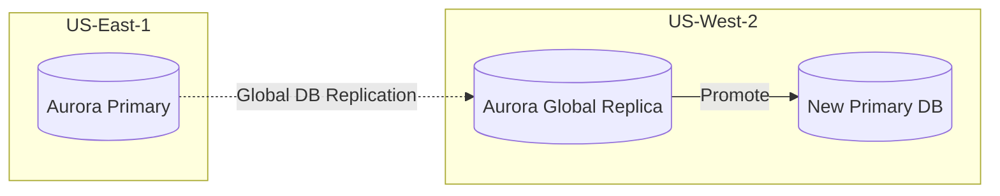

# Workshop 4: Multi-Region Disaster Recovery

## 1. Scenario & Objectives

You are the Lead Reliability Architect. You must design and implement a Multi-Region Disaster Recovery pipeline for a critical database application, targeting a Recovery Time Objective (RTO) under 5 minutes and a Recovery Point Objective (RPO) under 1 minute.

---

## 2. Target Architecture

---

## 3. Step-by-Step Implementation Guide

1. **Deploy Aurora Global Database:** Provision an Amazon Aurora PostgreSQL database cluster in us-east-1. Add a secondary replica cluster in us-west-2, configuring global database replication.
2. **Configure AWS Application Migration Service (MGN):** Install the replication agent on your application servers. Set us-west-2 as the target disaster recovery region.
3. **Deploy Route 53 Application Recovery Controller (ARC):** Create routing controls for both regions. Set up health checks that monitor compute and database state flags.
4. **Configure Automated Failover Scripts:** Write a Lambda function or configure AWS ARC to promote the Aurora replica in us-west-2 to primary database status during failovers.
5. **Execute DR Drill:** Trigger a mock primary region outage by blocking outbound database access in us-east-1.

---

## 4. Verification & Testing

- Run the recovery script. Verify that the secondary Aurora cluster in us-west-2 is promoted to primary status within 2 minutes (meeting RTO).
- Check replication logs to verify that the replication lag was under 5 seconds prior to the drill (meeting RPO).

---

## 5. Cleanup Instructions

- Convert the secondary promoted database back to a global replica under the primary region.
- Terminate active replication instances inside AWS MGN staging subnets.

---

## Prerequisites

- [Workshop 3](hybrid-enterprise-network.md)

## Recommended Next Topics

- [Workshop 2](global-saas-platform.md)

## Related Topics

- [Workshop 1](enterprise-landing-zone.md)
- [Workshop 3](hybrid-enterprise-network.md)
- [Workshop 1](enterprise-landing-zone.md)
