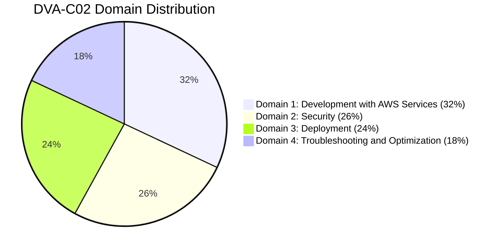

---
sidebar_position: 1
sidebar_label: Overview
---

# AWS Certified Developer – Associate (DVA-C02) Study Plan

*A comprehensive guide designed to prepare you for the AWS Certified Developer – Associate exam. This plan is fully based on detailed developer associate notes, covering core fundamentals, deep-dives, serverless architectures, containerization, security, and practice mock tests.*

---

## 🚀 Quick Navigation: Developer decision matrices & Exams
- [Phase 0: Foundation Bridge Overview](/docs/foundation-bridge/intro)
- [IAM: Identity Access & Management](/docs/Developer%20Associate/aws-fundamentals/iam)
- [EC2 & Security Groups](/docs/Developer%20Associate/aws-fundamentals/ec2)
- [Serverless Execution & Lambda](/docs/Developer%20Associate/aws-serverless/lambda)
- [DynamoDB Databases](/docs/Developer%20Associate/aws-serverless/dynamodb)
- [API Gateway Configurations](/docs/Developer%20Associate/aws-serverless/apigateway)
- [CI/CD Automation & Pipelines](/docs/Developer%20Associate/aws-deep-dive/cicd)
- [DVA-C02 Practice Mock Exams](/docs/Developer%20Associate/Practice%20Exams/DVA-C02-Mock-Exam)

---

## 🏆 DVA-C02 Exam Syllabus Coverage

---

## Phase 0: Foundation Bridge

Before starting with AWS, build enough IT knowledge so that AWS documentation, courses, and certifications start making sense.

*   **Overview & Action Plan:**
    *   [Phase 0 Overview & Action Plan](/docs/foundation-bridge/intro) — High-level goals, verification checklist, and the 3-Week action plan.
*   **Core Fundamentals:**
    *   [Module 1: How Computers Actually Work](/docs/foundation-bridge/how-computers-work) — Inputs/outputs, CPU, RAM, storage, operating systems, and binary basics.
    *   [Module 2: Linux Fundamentals](/docs/foundation-bridge/linux-fundamentals) — Directories, navigation commands (pwd, ls, cd, rm), users, and file permissions.
    *   [Module 3: Networking Fundamentals](/docs/foundation-bridge/networking-fundamentals) — Modems, routers, switches, IP addressing (public/private/static/dynamic), DNS, Ports (22, 80, 443, 3306), and HTTP/HTTPS.
*   **Application & Database Development:**
    *   [Module 4: Programming Fundamentals](/docs/foundation-bridge/programming-fundamentals) — Variables, loops, functions, lists, dictionaries, APIs, JSON, and Python.
    *   [Module 5: Database Fundamentals](/docs/foundation-bridge/databases) — Tables, rows, columns, basic SQL queries (SELECT, INSERT, UPDATE, DELETE), primary/foreign keys, and SQL vs. NoSQL.
    *   [Module 6: Web Application Fundamentals](/docs/foundation-bridge/web-application-fundamentals) — Static vs. dynamic apps, frontend framework rendering (CSR/SSR/SSG), backend business logic, and request-response flow.
*   **Infrastructure, DevOps & Security:**
    *   [Module 7: Servers & Infrastructure](/docs/foundation-bridge/servers-infrastructure) — Virtualization, Hypervisors, storage types (block, file, object), load balancing, and high availability.
    *   [Module 8: DevOps Foundations](/docs/foundation-bridge/devops-foundations) — Git version control (commits, branching, PRs), CI/CD pipelines, and Docker containerization.
    *   [Module 9: Security Foundations](/docs/foundation-bridge/security-foundations) — Authentication vs. authorization, symmetric/asymmetric encryption keys, Principle of Least Privilege, and secrets management.

---

## Phase 1: AWS Fundamentals

Get started with the foundational compute, storage, networking, and databases required for developer associates.

*   **Identity & Network Security:**
    *   [IAM: Identity Access & Management](/docs/Developer%20Associate/aws-fundamentals/iam) — Users, groups, roles, policy formats, federation, and simulator tools.
    *   [Security Groups](/docs/Developer%20Associate/aws-fundamentals/security-groups) — Inbound/outbound rules, referencing IP/CIDR blocks, and diagnosing network timeouts.
    *   [VPC: Virtual Private Cloud](/docs/Developer%20Associate/aws-fundamentals/vpc) — Subnets, internet gateways, route tables, and private/public IPs.
*   **Virtual Servers & Scaling:**
    *   [EC2: Virtual Machines](/docs/Developer%20Associate/aws-fundamentals/ec2) — Instance types, key pairs, user data scripts, and SSH connectivity configurations.
    *   [ELB: Elastic Load Balancers](/docs/Developer%20Associate/aws-fundamentals/elb) — Routing rules, listeners, health checks, and cross-zone load balancing.
    *   [ASG: Auto Scaling Group](/docs/Developer%20Associate/aws-fundamentals/asg) — Scaling policies, cooldown periods, launch templates, and minimum/maximum size limits.
*   **Storage & Databases:**
    *   [S3 Buckets](/docs/Developer%20Associate/aws-fundamentals/s3) — Objects, buckets, storage classes, versioning, security, and policies.
    *   [EBS: Elastic Block Store](/docs/Developer%20Associate/aws-fundamentals/ebs) — Volumes, snapshots, instance store local drives, and performance IOPS limits.
    *   [RDS: Relational Database Service](/docs/Developer%20Associate/aws-fundamentals/rds) — Postgres/MySQL, Multi-AZ high availability, Read Replicas, and backups.
    *   [ElastiCache](/docs/Developer%20Associate/aws-fundamentals/elasticache) — Redis vs. Memcached engines, caching strategies, and performance patterns.
*   **Domain Name Services:**
    *   [Route 53](/docs/Developer%20Associate/aws-fundamentals/route53) — DNS records (A, AAAA, CNAME, Alias), hosted zones, and routing logic.

---

## Phase 2: AWS Deep Dive & Deployment

Advanced tools for configuration, automated pipelines, orchestration, infrastructure-as-code, and monitoring.

*   **Command Line & Development Kits:**
    *   [CLI: Command Line Interface](/docs/Developer%20Associate/aws-deep-dive/cli) — CLI configuration, credentials profiles, and dry-run API calls.
    *   [SDK: Software Development Kit](/docs/Developer%20Associate/aws-deep-dive/sdk) — Language bindings, client connections, retry policies, and timeout tuning.
*   **PaaS & Containerized Deployments:**
    *   [Elastic Beanstalk](/docs/Developer%20Associate/aws-deep-dive/elastic-beanstalk) — Platform configurations, deployment types (rolling, canary), and `.ebextensions` customization scripts.
*   **Continuous Delivery & Deployments (CI/CD):**
    *   [CICD Integration Intro](/docs/Developer%20Associate/aws-deep-dive/cicd) — Automation benefits, repositories, builds, test runners, and pipeline stages.
    *   [CodeCommit](/docs/Developer%20Associate/aws-deep-dive/cicd/codecommit) — Git repositories, branches, pull requests, and permissions mapping.
    *   [CodeBuild](/docs/Developer%20Associate/aws-deep-dive/cicd/codebuild) — Compilation containers, runtime setup, artifacts cache, and `buildspec.yml` stages.
    *   [CodeDeploy](/docs/Developer%20Associate/aws-deep-dive/cicd/codedeploy) — Lifecycle hooks, `appspec.yml` configurations, and ECS/Lambda target group updates.
    *   [CodePipeline](/docs/Developer%20Associate/aws-deep-dive/cicd/codepipeline) — Multi-stage release orchestrations, custom actions, and EventBridge triggers.
*   **Infrastructure as Code & Templates:**
    *   [CloudFormation](/docs/Developer%20Associate/aws-deep-dive/cloudformation) — Resources, parameters, mappings, outputs, stack sets, and templates.
    *   [YAML Formatting](/docs/Developer%20Associate/aws-deep-dive/yaml) — Syntax, key-value mappings, and list structures.
*   **Messaging & Streaming Integrations:**
    *   [Integration Intro](/docs/Developer%20Associate/aws-deep-dive/integration-and-messaging/intro) — De-coupling architectures, publish/subscribe, and data pipelines.
    *   [SQS: Simple Queue Service](/docs/Developer%20Associate/aws-deep-dive/integration-and-messaging/sqs) — Standard vs. FIFO queues, visibility timeouts, dead letter queues (DLQs), and polling strategies.
    *   [SNS: Simple Notification Service](/docs/Developer%20Associate/aws-deep-dive/integration-and-messaging/sns) — Topics, subscribers, message filtering policies, fan-out configurations, and SMS/Email endpoints.
    *   [Kinesis Streams](/docs/Developer%20Associate/aws-deep-dive/integration-and-messaging/kinesis) — Shards, partition keys, hot spot resolution, and Firehose data ingestion.
*   **Monitoring, Auditing & Tracing:**
    *   [CloudWatch](/docs/Developer%20Associate/aws-deep-dive/monitoring-and-audit/cloudwatch) — Custom namespaces, metric filters, alarm triggers, and logs.
    *   [CloudTrail](/docs/Developer%20Associate/aws-deep-dive/monitoring-and-audit/cloudtrail) — API tracking, user auditing, and write/read event logs.
    *   [AWS Config](/docs/Developer%20Associate/aws-deep-dive/monitoring-and-audit/config) — Configuration rules, history tracking, and resource compliance auditing.
    *   [AWS X-Ray](/docs/Developer%20Associate/aws-deep-dive/monitoring-and-audit/xray) — Subsegment tracing, instrumentation SDK APIs, service maps, annotations, and metadata details.

---

## Phase 3: AWS Serverless

Advanced serverless architectures that require no server configuration and auto-scale dynamically.

*   **Serverless Introduction:**
    *   [Serverless Intro](/docs/Developer%20Associate/aws-serverless/serverless) — Serverless benefits, architectures, and cost considerations.
*   **FaaS & API Management:**
    *   [AWS Lambda](/docs/Developer%20Associate/aws-serverless/lambda) — Concurrency, execution environment cold/warm starts, handler functions, and invocation types (sync/async/esm).
    *   [API Gateway](/docs/Developer%20Associate/aws-serverless/apigateway) — REST vs. HTTP APIs, custom Lambda authorizers, CORS controls, and response mapping templates.
*   **Serverless Database & Workflows:**
    *   [Amazon DynamoDB](/docs/Developer%20Associate/aws-serverless/dynamodb) — Partition/Sort keys, WCU/RCU calculations, local/global secondary indexes (LSI vs. GSI), streams, optimistic locking, and DAX caches.
    *   [Step Functions](/docs/Developer%20Associate/aws-serverless/stepfunctions) — Visual workflows, Standard vs. Express state machines, retry policies, and error catch paths.
*   **Application Frameworks & GraphQL:**
    *   [SAM: Serverless Application Model](/docs/Developer%20Associate/aws-serverless/sam) — Declarative template structures, SAM local testing commands, and package/deploy cycles.
    *   [Cognito](/docs/Developer%20Associate/aws-serverless/cognito) — User Pools user directory vs. Identity Pools for temporary AWS credential exchanges.
    *   [AppSync](/docs/Developer%20Associate/aws-serverless/appsync) — GraphQL schema formats, queries, mutations, subscriptions, and resolvers.

---

## Phase 4: Docker & Containerization

Manage containerized application lifecycles and microservices.

*   [ECS: Elastic Container Service](/docs/Developer%20Associate/aws-containers/ecs) — Clusters, task definitions, service scaling rules, and networking modes.
*   [ECR: Elastic Container Registry](/docs/Developer%20Associate/aws-containers/ecr) — Docker images, repository policies, credentials, and image tag scanning.
*   [Fargate](/docs/Developer%20Associate/aws-containers/fargate) — Serverless container compute model, CPU/Memory configurations, and security profiles.

---

## Phase 5: Security & Encryption

Master key security, envelope encryption, and safe credentials management.

*   [KMS: Key Management Service](/docs/Developer%20Associate/others/kms) — Key policies, customer managed keys, and envelope encryption API flows (`GenerateDataKey`).
*   [Secrets Manager](/docs/Developer%20Associate/others/secret-manager) — Automatic API credentials rotation, security boundaries, and Systems Manager Parameter Store integrations.

---

## Phase 6: DVA-C02 Practice Mock Exams
Before taking the official exam, validate your readiness with three full-length practice tests under timed conditions:

*   **[DVA-C02 Mock Exam Overview & Syllabus Mapping](/docs/Developer%20Associate/Practice%20Exams/DVA-C02-Mock-Exam)**
*   **🏆 Mock Exam 1 (75 Questions):**
    *   [Part 1: Questions 1 - 25](/docs/Developer%20Associate/Practice%20Exams/DVA-C02-Mock-Exam-Part-1) (Domain 1 & 2)
    *   [Part 2: Questions 26 - 50](/docs/Developer%20Associate/Practice%20Exams/DVA-C02-Mock-Exam-Part-2) (Domain 2 & 3)
    *   [Part 3: Questions 51 - 75](/docs/Developer%20Associate/Practice%20Exams/DVA-C02-Mock-Exam-Part-3) (Domain 3 & 4)
*   **🏆 Mock Exam 2 (75 Questions):**
    *   [Part 1: Questions 1 - 25](/docs/Developer%20Associate/Practice%20Exams/DVA-C02-Mock-Exam-2-Part-1) (Domain 1 & 2)
    *   [Part 2: Questions 26 - 50](/docs/Developer%20Associate/Practice%20Exams/DVA-C02-Mock-Exam-2-Part-2) (Domain 2 & 3)
    *   [Part 3: Questions 51 - 75](/docs/Developer%20Associate/Practice%20Exams/DVA-C02-Mock-Exam-2-Part-3) (Domain 3 & 4)
*   **🌶️ Mock Exam 3 (75 Questions - Advanced Difficulty):**
    *   [Part 1: Questions 1 - 25](/docs/Developer%20Associate/Practice%20Exams/DVA-C02-Mock-Exam-3-Part-1) (Domain 1 & 2)
    *   [Part 2: Questions 26 - 50](/docs/Developer%20Associate/Practice%20Exams/DVA-C02-Mock-Exam-3-Part-2) (Domain 2 & 3)
    *   [Part 3: Questions 51 - 75](/docs/Developer%20Associate/Practice%20Exams/DVA-C02-Mock-Exam-3-Part-3) (Domain 3 & 4)
