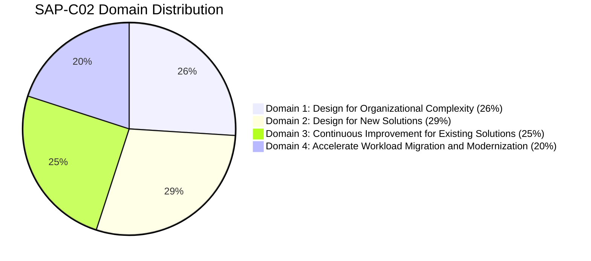

# AWS Certified Solutions Architect – Professional (SAP-C02) Study Plan

_A comprehensive guide to help you prepare for the AWS Certified Solutions Architect – Professional exam. This structured study plan moves from foundational AWS services to advanced topics, covering all the services in the [exam guide](https://d1.awsstatic.com/training-and-certification/docs-sa-pro/AWS-Certified-Solutions-Architect-Professional_Exam-Guide.pdf)._

## 🚀 Quick Navigation: Architect's Decision Matrices & Exams
- [Database Choice: RDS vs. DynamoDB](/docs/Solutions%20Architect%20Professional/Database/NoSQL%20Databases/Amazon%20DynamoDB#6-architects-decision-matrix-dynamodb-vs-rds)
- [DR Strategies: RPO/RTO Comparison](/docs/Solutions%20Architect%20Professional/Storage/Backup%20&%20Disaster%20Recovery/Disaster%20Recovery%20Strategies#dr-strategies-comparison)
- [Global Traffic: CloudFront vs. Global Accelerator](/docs/Solutions%20Architect%20Professional/Networking%20and%20Content%20Delivery/CDN%20&%20DNS/Global%20Traffic%20Management#cloudfront-vs-global-accelerator)
- [Secrets: Parameter Store vs. Secrets Manager](/docs/Solutions%20Architect%20Professional/Management%20and%20Governance/Operations%20&%20Optimization/AWS%20Systems%20Manager#203-parameter-store-vs-secrets-manager)
- [Migration: The 6R's Decision Matrix](/docs/Solutions%20Architect%20Professional/Migration%20and%20Transfer/Migration%20Tools/Migration%20Strategies#the-6r-strategies)
- [Practice Assessment: 75-Question SAP-C02 Mock Exam](/docs/Solutions%20Architect%20Professional/Practice%20Exams/SAP-C02%20Mock%20Exam)

---

## 🏆 SAP-C02 Exam Overview & Syllabus Coverage

Before beginning your preparation, familiarize yourself with the official **AWS Certified Solutions Architect – Professional (SAP-C02)** exam format and weights:

| Parameter | Details |
| :--- | :--- |
| **Exam Code** | SAP-C02 |
| **Level** | Professional |
| **Duration** | 180 Minutes |
| **Number of Questions** | 75 (Multiple Choice or Multiple Response) |
| **Passing Score** | 750 / 1000 |
| **Cost** | $300 USD |

## Phase 1: Foundations & Core Services

### 1. Compute Fundamentals

#### Virtual Machines & Infrastructure
- [AWS Outposts](/docs/Solutions%20Architect%20Professional/Compute/Virtual%20Machines%20&%20Infrastructure/AWS%20Outposts)
- [AWS Wavelength](/docs/Solutions%20Architect%20Professional/Compute/Virtual%20Machines%20&%20Infrastructure/AWS%20Wavelength)
- **EC2:**
  - [Amazon EC2](/docs/Solutions%20Architect%20Professional/Compute/Virtual%20Machines%20&%20Infrastructure/EC2/Amazon%20EC2)
  - [Amazon EC2 - Auto Scaling](/docs/Solutions%20Architect%20Professional/Compute/Virtual%20Machines%20&%20Infrastructure/EC2/Amazon%20EC2%20-%20Auto%20Scaling)
  - [Amazon EC2 - Fleets](/docs/Solutions%20Architect%20Professional/Compute/Virtual%20Machines%20&%20Infrastructure/EC2/Amazon%20EC2%20-%20Fleets)
  - [Amazon EC2 - Monitoring](/docs/Solutions%20Architect%20Professional/Compute/Virtual%20Machines%20&%20Infrastructure/EC2/Amazon%20EC2%20-%20Monitoring)
  - [Amazon EC2 - Networking](/docs/Solutions%20Architect%20Professional/Compute/Virtual%20Machines%20&%20Infrastructure/EC2/Amazon%20EC2%20-%20Networking)
  - [Amazon EC2 - Security](/docs/Solutions%20Architect%20Professional/Compute/Virtual%20Machines%20&%20Infrastructure/EC2/Amazon%20EC2%20-%20Security)
- [EC2 Image Builder](/docs/Solutions%20Architect%20Professional/Compute/Virtual%20Machines%20&%20Infrastructure/EC2%20Image%20Builder)

#### Serverless & Managed Compute
- [AWS Lambda](/docs/Solutions%20Architect%20Professional/Compute/Serverless%20&%20Managed%20Compute/AWS%20Lambda)
- [AWS Elastic Beanstalk](/docs/Solutions%20Architect%20Professional/Compute/Serverless%20&%20Managed%20Compute/AWS%20Elastic%20Beanstalk)
- [AWS App Runner](/docs/Solutions%20Architect%20Professional/Compute/Serverless%20&%20Managed%20Compute/AWS%20App%20Runner)

#### Scaling & Batch Processing
- [AWS Auto Scaling](/docs/Solutions%20Architect%20Professional/Compute/Scaling%20&%20Batch%20Processing/AWS%20Auto%20Scaling)
- [AWS Batch](/docs/Solutions%20Architect%20Professional/Compute/Scaling%20&%20Batch%20Processing/AWS%20Batch)

#### Simplified Compute
- [Amazon Lightsail](/docs/Solutions%20Architect%20Professional/Compute/Simplified%20Compute/Amazon%20Lightsail)

### 2. Networking and Content Delivery

#### Virtual Networking & Connectivity
- [Amazon VPC](/docs/Solutions%20Architect%20Professional/Networking%20and%20Content%20Delivery/Virtual%20Networking%20&%20Connectivity/Amazon%20VPC)
- [AWS Direct Connect](/docs/Solutions%20Architect%20Professional/Networking%20and%20Content%20Delivery/Virtual%20Networking%20&%20Connectivity/AWS%20Direct%20Connect)
- [AWS Local Zones](/docs/Solutions%20Architect%20Professional/Networking%20and%20Content%20Delivery/Virtual%20Networking%20&%20Connectivity/AWS%20Local%20Zones)
- [AWS Transit Gateway](/docs/Solutions%20Architect%20Professional/Networking%20and%20Content%20Delivery/Virtual%20Networking%20&%20Connectivity/AWS%20Transit%20Gateway)
- [AWS VPN](/docs/Solutions%20Architect%20Professional/Networking%20and%20Content%20Delivery/Virtual%20Networking%20&%20Connectivity/AWS%20VPN)

#### CDN & DNS
- [Amazon CloudFront](/docs/Solutions%20Architect%20Professional/Networking%20and%20Content%20Delivery/CDN%20&%20DNS/Amazon%20CloudFront)
- [AWS Route 53](/docs/Solutions%20Architect%20Professional/Networking%20and%20Content%20Delivery/CDN%20&%20DNS/AWS%20Route%2053)
- [AWS Global Accelerator](/docs/Solutions%20Architect%20Professional/Networking%20and%20Content%20Delivery/CDN%20&%20DNS/Global%20Traffic%20Management#2-aws-global-accelerator)
- [Global Traffic Management](/docs/Solutions%20Architect%20Professional/Networking%20and%20Content%20Delivery/CDN%20&%20DNS/Global%20Traffic%20Management)

#### Hybrid Connectivity & Traffic Management
- [AWS PrivateLink](/docs/Solutions%20Architect%20Professional/Networking%20and%20Content%20Delivery/Hybrid%20Connectivity/AWS%20PrivateLink)
- [Hybrid Connectivity & RAM](/docs/Solutions%20Architect%20Professional/Networking%20and%20Content%20Delivery/Hybrid%20Connectivity/Hybrid%20Connectivity%20&%20RAM)
- [AWS Elastic Load Balancing](/docs/Solutions%20Architect%20Professional/Networking%20and%20Content%20Delivery/Traffic%20Management/AWS%20Elastic%20Load%20Balancing)
- [AWS VPC Lattice](/docs/Solutions%20Architect%20Professional/Networking%20and%20Content%20Delivery/Traffic%20Management/AWS%20VPC%20Lattice)

### 3. Storage & Database Fundamentals

#### Object, Block, & File Storage
- [Amazon S3](/docs/Solutions%20Architect%20Professional/Storage/Object,%20Block,%20&%20File%20Storage/Amazon%20S3)
- [Amazon Elastic Block Storage (EBS)](/docs/Solutions%20Architect%20Professional/Storage/Object,%20Block,%20&%20File%20Storage/Amazon%20Elastic%20Block%20Storage)
- [Amazon Elastic File System (EFS)](/docs/Solutions%20Architect%20Professional/Storage/Object,%20Block,%20&%20File%20Storage/Amazon%20Elastic%20File%20System)
- [Amazon FSx](/docs/Solutions%20Architect%20Professional/Storage/Object,%20Block,%20&%20File%20Storage/Amazon%20FSx)

#### Backup & Disaster Recovery
- [AWS Backup](/docs/Solutions%20Architect%20Professional/Storage/Backup%20&%20Disaster%20Recovery/AWS%20Backup)
- [AWS Elastic Disaster Recovery (DRS)](/docs/Solutions%20Architect%20Professional/Storage/Backup%20&%20Disaster%20Recovery/AWS%20Elastic%20Disaster%20Recovery)
- [AWS Storage Gateway](/docs/Solutions%20Architect%20Professional/Storage/Backup%20&%20Disaster%20Recovery/AWS%20Storage%20Gateway)
- [Disaster Recovery Strategies](/docs/Solutions%20Architect%20Professional/Storage/Backup%20&%20Disaster%20Recovery/Disaster%20Recovery%20Strategies)

#### Relational & Data Warehouse
- [Amazon Aurora](/docs/Solutions%20Architect%20Professional/Database/Relational%20&%20Data%20Warehouse/Amazon%20Aurora)
- [Amazon RDS](/docs/Solutions%20Architect%20Professional/Database/Relational%20&%20Data%20Warehouse/Amazon%20RDS)
- [Amazon Redshift](/docs/Solutions%20Architect%20Professional/Database/Relational%20&%20Data%20Warehouse/Amazon%20Redshift)

#### NoSQL & Specialized Databases
- [Amazon DocumentDB](/docs/Solutions%20Architect%20Professional/Database/NoSQL%20Databases/Amazon%20DocumentDB)
- [Amazon DynamoDB](/docs/Solutions%20Architect%20Professional/Database/NoSQL%20Databases/Amazon%20DynamoDB)
- [Amazon Keyspaces](/docs/Solutions%20Architect%20Professional/Database/NoSQL%20Databases/Amazon%20Keyspaces)
- [Amazon ElastiCache](/docs/Solutions%20Architect%20Professional/Database/Specialized%20&%20In-Memory/Amazon%20ElastiCache)
- [Amazon Neptune](/docs/Solutions%20Architect%20Professional/Database/Specialized%20&%20In-Memory/Amazon%20Neptune)
- [Amazon Timestream](/docs/Solutions%20Architect%20Professional/Database/Specialized%20&%20In-Memory/Amazon%20Timestream)

### 4. Security, Identity, & Compliance Fundamentals

#### Identity & Access Management
- [Amazon Cognito](/docs/Solutions%20Architect%20Professional/Security,%20Identity,%20and%20Compliance/Identity%20&%20Access%20Management/Amazon%20Cognito)
- [AWS Directory Services](/docs/Solutions%20Architect%20Professional/Security,%20Identity,%20and%20Compliance/Identity%20&%20Access%20Management/AWS%20Directory%20Services)
- [AWS IAM Identity Center](/docs/Solutions%20Architect%20Professional/Security,%20Identity,%20and%20Compliance/Identity%20&%20Access%20Management/AWS%20IAM%20Identity%20Center)
- [AWS Identity and Access Management](/docs/Solutions%20Architect%20Professional/Security,%20Identity,%20and%20Compliance/Identity%20&%20Access%20Management/AWS%20Identity%20and%20Access%20Management)
- [Amazon Verified Permissions](/docs/Solutions%20Architect%20Professional/Security,%20Identity,%20and%20Compliance/Identity%20&%20Access%20Management/Amazon%20Verified%20Permissions)
- [AWS Verified Access](/docs/Solutions%20Architect%20Professional/Security,%20Identity,%20and%20Compliance/Identity%20&%20Access%20Management/AWS%20Verified%20Access)

#### Data Protection & Encryption
- [AWS Certificate Manager](/docs/Solutions%20Architect%20Professional/Security,%20Identity,%20and%20Compliance/Data%20Protection%20&%20Encryption/AWS%20Certificate%20Manager)
- [AWS CloudHSM](/docs/Solutions%20Architect%20Professional/Security,%20Identity,%20and%20Compliance/Data%20Protection%20&%20Encryption/AWS%20CloudHSM)
- [AWS Key Management Service](/docs/Solutions%20Architect%20Professional/Security,%20Identity,%20and%20Compliance/Data%20Protection%20&%20Encryption/AWS%20Key%20Management%20Service)
- [AWS Macie](/docs/Solutions%20Architect%20Professional/Security,%20Identity,%20and%20Compliance/Data%20Protection%20&%20Encryption/AWS%20Macie)
- [AWS Secrets Manager](/docs/Solutions%20Architect%20Professional/Security,%20Identity,%20and%20Compliance/Data%20Protection%20&%20Encryption/AWS%20Secrets%20Manager)

#### Network Security
- [AWS Firewall Manager](/docs/Solutions%20Architect%20Professional/Security,%20Identity,%20and%20Compliance/Network%20Security/AWS%20Firewall%20Manager)
- [AWS Network Firewall](/docs/Solutions%20Architect%20Professional/Security,%20Identity,%20and%20Compliance/Network%20Security/AWS%20Network%20Firewall)
- [AWS Shield](/docs/Solutions%20Architect%20Professional/Security,%20Identity,%20and%20Compliance/Network%20Security/AWS%20Shield)
- [AWS WAF](/docs/Solutions%20Architect%20Professional/Security,%20Identity,%20and%20Compliance/Network%20Security/AWS%20WAF)

#### Compliance & Governance (Basics)
- [AWS Artifact](/docs/Solutions%20Architect%20Professional/Security,%20Identity,%20and%20Compliance/Compliance%20&%20Governance/AWS%20Artifact)
- [AWS Audit Manager](/docs/Solutions%20Architect%20Professional/Security,%20Identity,%20and%20Compliance/Compliance%20&%20Governance/AWS%20Audit%20Manager)
- [AWS Resource Access Manager](/docs/Solutions%20Architect%20Professional/Security,%20Identity,%20and%20Compliance/Compliance%20&%20Governance/AWS%20Resource%20Access%20Manager)

---

## Phase 2: Management, Monitoring, & Integration

### 1. Management & Governance

#### Monitoring & Observability
- [Amazon CloudWatch](/docs/Solutions%20Architect%20Professional/Management%20and%20Governance/Monitoring%20&%20Observability/Amazon%20CloudWatch)
- [AWS CloudTrail](/docs/Solutions%20Architect%20Professional/Management%20and%20Governance/Monitoring%20&%20Observability/AWS%20CloudTrail)
- [AWS Personal Health Dashboard](/docs/Solutions%20Architect%20Professional/Management%20and%20Governance/Monitoring%20&%20Observability/AWS%20Personal%20Health%20Dashboard)

#### Infrastructure Automation
- [AWS CloudFormation](/docs/Solutions%20Architect%20Professional/Management%20and%20Governance/Infrastructure%20Automation/AWS%20CloudFormation)
- [AWS Cloud Development Kit (CDK)](/docs/Solutions%20Architect%20Professional/Management%20and%20Governance/Infrastructure%20Automation/AWS%20Cloud%20Development%20Kit)

#### Governance & Compliance (Advanced)
- [AWS Config](/docs/Solutions%20Architect%20Professional/Management%20and%20Governance/Governance%20&%20Compliance/AWS%20Config)
- [AWS Control Tower](/docs/Solutions%20Architect%20Professional/Management%20and%20Governance/Governance%20&%20Compliance/AWS%20Control%20Tower)
- [AWS Organizations](/docs/Solutions%20Architect%20Professional/Management%20and%20Governance/Governance%20&%20Compliance/AWS%20Organizations)
- [AWS Service Catalog](/docs/Solutions%20Architect%20Professional/Management%20and%20Governance/Governance%20&%20Compliance/AWS%20Service%20Catalog)
- [AWS Service Quotas](/docs/Solutions%20Architect%20Professional/Management%20and%20Governance/Governance%20&%20Compliance/AWS%20Service%20Quotas)
- [AWS Well-Architected Tool](/docs/Solutions%20Architect%20Professional/Management%20and%20Governance/Governance%20&%20Compliance/AWS%20Well-Architected%20Tool)

#### Operations & Optimization
- [AWS Compute Optimizer](/docs/Solutions%20Architect%20Professional/Management%20and%20Governance/Operations%20&%20Optimization/AWS%20Compute%20Optimizer)
- [AWS Systems Manager](/docs/Solutions%20Architect%20Professional/Management%20and%20Governance/Operations%20&%20Optimization/AWS%20Systems%20Manager)
- [AWS Trusted Advisor](/docs/Solutions%20Architect%20Professional/Management%20and%20Governance/Operations%20&%20Optimization/AWS%20Trusted%20Advisor)
- [Cost Optimization Tools](/docs/Solutions%20Architect%20Professional/Management%20and%20Governance/Cost%20Management/Cost%20Optimization%20Tools)

### 2. Application Integration

#### API & Workflow Integration
- [AWS AppSync](/docs/Solutions%20Architect%20Professional/Application%20Integration/API%20&%20Workflow%20Integration/AWS%20AppSync)
- [AWS Step Functions](/docs/Solutions%20Architect%20Professional/Application%20Integration/API%20&%20Workflow%20Integration/AWS%20Step%20Functions)

#### Messaging & Eventing
- [Amazon EventBridge](/docs/Solutions%20Architect%20Professional/Application%20Integration/Messaging%20&%20Eventing/Amazon%20EventBridge)
- [Amazon MQ](/docs/Solutions%20Architect%20Professional/Application%20Integration/Messaging%20&%20Eventing/Amazon%20MQ)
- [Amazon SNS](/docs/Solutions%20Architect%20Professional/Application%20Integration/Messaging%20&%20Eventing/Amazon%20SNS)
- [Amazon SQS](/docs/Solutions%20Architect%20Professional/Application%20Integration/Messaging%20&%20Eventing/Amazon%20SQS)

### 3. Cloud Financial Management

#### Cost Allocation & Savings
- [AWS Cost Allocation Tags](/docs/Solutions%20Architect%20Professional/Cloud%20Financial%20Management/Cost%20Allocation%20&%20Savings/AWS%20Cost%20Allocation%20Tags)
- [Savings Plans](/docs/Solutions%20Architect%20Professional/Cloud%20Financial%20Management/Cost%20Allocation%20&%20Savings/Savings%20Plans)

#### Cost Monitoring & Budgeting
- [AWS Budgets](/docs/Solutions%20Architect%20Professional/Cloud%20Financial%20Management/Cost%20Monitoring%20&%20Budgeting/AWS%20Budgets)
- [AWS Cost Explorer](/docs/Solutions%20Architect%20Professional/Cloud%20Financial%20Management/Cost%20Monitoring%20&%20Budgeting/AWS%20Cost%20Explorer)

### 4. Containers & Developer Tools

#### Containers

**Container Orchestration:**
- [Amazon ECS](/docs/Solutions%20Architect%20Professional/Containers/Container%20Orchestration/Amazon%20ECS)
- [Amazon EKS](/docs/Solutions%20Architect%20Professional/Containers/Container%20Orchestration/Amazon%20EKS)

**Container Registry:**
- [Amazon ECR](/docs/Solutions%20Architect%20Professional/Containers/Container%20Registry/Amazon%20ECR)

#### Developer Tools

**CICD & Code Quality:**
- [Amazon CodeGuru](/docs/Solutions%20Architect%20Professional/Developer%20Tools/CICD%20&%20Code%20Quality/Amazon%20CodeGuru)
- [AWS CodeBuild, AWS CodeDeploy, AWS CodePipeline, AWS CodeArtifact](/docs/Solutions%20Architect%20Professional/Developer%20Tools/CICD%20&%20Code%20Quality/AWS%20CodeBuild,%20AWS%20CodeDeploy,%20AWS%20CodePipeline,%20AWS%20CodeArtifact)

**Observability & Testing:**
- [AWS Fault Injection Simulator](/docs/Solutions%20Architect%20Professional/Developer%20Tools/Observability%20&%20Testing/AWS%20Fault%20Injection%20Simulator)
- [AWS X-Ray](/docs/Solutions%20Architect%20Professional/Developer%20Tools/Observability%20&%20Testing/AWS%20X-Ray)

### 5. Frontend Web, Mobile & End User Computing

#### Frontend Web and Mobile

**API Management:**
- [Amazon API Gateway](/docs/Solutions%20Architect%20Professional/Frontend%20Web%20and%20Mobile/API%20Management/Amazon%20API%20Gateway)

**Development Platforms:**
- [AWS Amplify](/docs/Solutions%20Architect%20Professional/Frontend%20Web%20and%20Mobile/Development%20Platforms/AWS%20Amplify)
- [AWS Device Farm](/docs/Solutions%20Architect%20Professional/Frontend%20Web%20and%20Mobile/Development%20Platforms/AWS%20Device%20Farm)

**User Engagement:**
- [Amazon Pinpoint](/docs/Solutions%20Architect%20Professional/Frontend%20Web%20and%20Mobile/User%20Engagement/Amazon%20Pinpoint)

#### End User Computing
- [Amazon AppStream 2.0](/docs/Solutions%20Architect%20Professional/End%20User%20Computing/Amazon%20AppStream%202.0)
- [Amazon WorkSpaces](/docs/Solutions%20Architect%20Professional/End%20User%20Computing/Amazon%20WorkSpaces)

### 6. Migration & Transfer

#### File Transfer
- [AWS Transfer Family](/docs/Solutions%20Architect%20Professional/Migration%20and%20Transfer/File%20Transfer/AWS%20Transfer%20Family)

#### Migration Tools
- [AWS Application Discovery Service](/docs/Solutions%20Architect%20Professional/Migration%20and%20Transfer/Migration%20Tools/AWS%20Application%20Discovery%20Service)
- [AWS Application Migration Service (MGN)](/docs/Solutions%20Architect%20Professional/Migration%20and%20Transfer/Migration%20Tools/AWS%20Application%20Migration%20Service)
- [AWS Database Migration Service](/docs/Solutions%20Architect%20Professional/Migration%20and%20Transfer/Migration%20Tools/AWS%20Database%20Migration%20Service)
- [AWS DataSync](/docs/Solutions%20Architect%20Professional/Migration%20and%20Transfer/Migration%20Tools/AWS%20DataSync)
- [AWS Migration Evaluator](/docs/Solutions%20Architect%20Professional/Migration%20and%20Transfer/Migration%20Tools/AWS%20Migration%20Evaluator)
- [AWS Migration Hub](/docs/Solutions%20Architect%20Professional/Migration%20and%20Transfer/Migration%20Tools/AWS%20Migration%20Hub)
- [Migration Strategies](/docs/Solutions%20Architect%20Professional/Migration%20and%20Transfer/Migration%20Tools/Migration%20Strategies)

#### Physical & Offline Migration
- [AWS Snow Family](/docs/Solutions%20Architect%20Professional/Migration%20and%20Transfer/Physical%20&%20Offline%20Migration/AWS%20Snow%20Family)

---

## Phase 3: Specialized & Advanced Topics

### 1. Analytics

#### Data Integration & Management
- [AWS Data Exchange](/docs/Solutions%20Architect%20Professional/Analytics/Data%20Integration%20&%20Management/AWS%20Data%20Exchange)
- [AWS Glue](/docs/Solutions%20Architect%20Professional/Analytics/Data%20Integration%20&%20Management/AWS%20Glue)
- [AWS Lake Formation](/docs/Solutions%20Architect%20Professional/Analytics/Data%20Integration%20&%20Management/AWS%20Lake%20Formation)

#### Interactive Query & Batch Processing
- [Amazon Athena](/docs/Solutions%20Architect%20Professional/Analytics/Interactive%20Query%20&%20Batch%20Processing/Amazon%20Athena)
- [Amazon EMR](/docs/Solutions%20Architect%20Professional/Analytics/Interactive%20Query%20&%20Batch%20Processing/Amazon%20EMR)

#### Streaming Data & Real-Time Analytics
- [Amazon Data Firehose](/docs/Solutions%20Architect%20Professional/Analytics/Streaming%20Data%20&%20Real-Time%20Analytics/Amazon%20Data%20Firehose)
- [Amazon Kinesis Data Streams](/docs/Solutions%20Architect%20Professional/Analytics/Streaming%20Data%20&%20Real-Time%20Analytics/Amazon%20Kinesis%20Data%20Streams)
- [Amazon Managed Service for Apache Flink](/docs/Solutions%20Architect%20Professional/Analytics/Streaming%20Data%20&%20Real-Time%20Analytics/Amazon%20Managed%20Service%20for%20Apache%20Flink)
- [Amazon Managed Streaming for Apache Kafka](/docs/Solutions%20Architect%20Professional/Analytics/Streaming%20Data%20&%20Real-Time%20Analytics/Amazon%20Managed%20Streaming%20for%20Apache%20Kafka)

#### Visualization & Search
- [Amazon OpenSearch](/docs/Solutions%20Architect%20Professional/Analytics/Visualization%20&%20Search/Amazon%20OpenSearch)
- [Amazon OpenSearch Serverless](/docs/Solutions%20Architect%20Professional/Analytics/Visualization%20&%20Search/Amazon%20OpenSearch%20Serverless)
- [Amazon QuickSight](/docs/Solutions%20Architect%20Professional/Analytics/Visualization%20&%20Search/Amazon%20QuickSight)

### 2. Machine Learning & AI

#### Generative AI (Latest Trend)
- [Amazon Bedrock](/docs/Solutions%20Architect%20Professional/Machine%20Learning/Generative%20AI/Amazon%20Bedrock)
- [Amazon Q](/docs/Solutions%20Architect%20Professional/Machine%20Learning/Generative%20AI/Amazon%20Q)

#### Computer Vision & Document Processing
- [Amazon Rekognition](/docs/Solutions%20Architect%20Professional/Machine%20Learning/Computer%20Vision%20&%20Document%20Processing/Amazon%20Rekognition)
- [Amazon Textract](/docs/Solutions%20Architect%20Professional/Machine%20Learning/Computer%20Vision%20&%20Document%20Processing/Amazon%20Textract)

#### ML Platform
- [Amazon SageMaker](/docs/Solutions%20Architect%20Professional/Machine%20Learning/ML%20Platform/Amazon%20SageMaker)

#### Natural Language & Speech
- [Amazon Comprehend](/docs/Solutions%20Architect%20Professional/Machine%20Learning/Natural%20Language%20&%20Speech/Amazon%20Comprehend)
- [Amazon Lex](/docs/Solutions%20Architect%20Professional/Machine%20Learning/Natural%20Language%20&%20Speech/Amazon%20Lex)
- [Amazon Transcribe](/docs/Solutions%20Architect%20Professional/Machine%20Learning/Natural%20Language%20&%20Speech/Amazon%20Transcribe)
- [Amazon Translate](/docs/Solutions%20Architect%20Professional/Machine%20Learning/Natural%20Language%20&%20Speech/Amazon%20Translate)

#### Search & Personalization
- [Amazon Kendra](/docs/Solutions%20Architect%20Professional/Machine%20Learning/Search%20&%20Personalization/Amazon%20Kendra)
- [Amazon Personalize](/docs/Solutions%20Architect%20Professional/Machine%20Learning/Search%20&%20Personalization/Amazon%20Personalize)

#### Speech Synthesis
- [Amazon Polly](/docs/Solutions%20Architect%20Professional/Machine%20Learning/Speech%20Synthesis/Amazon%20Polly)

### 3. Business Applications

#### Contact Center & Email
- [Amazon Connect](/docs/Solutions%20Architect%20Professional/Business%20Applications/Contact%20Center%20&%20Email/Amazon%20Connect)
- [Amazon SES](/docs/Solutions%20Architect%20Professional/Business%20Applications/Contact%20Center%20&%20Email/Amazon%20SES)

#### Voice & Collaboration
- [AWS Alexa for Business](/docs/Solutions%20Architect%20Professional/Business%20Applications/Voice%20&%20Collaboration/AWS%20Alexa%20for%20Business)

### 4. Internet of Things & Media Services

#### Internet of Things
- [AWS IoT Services](/docs/Solutions%20Architect%20Professional/Internet%20of%20Things/AWS%20IoT%20Services)

#### Media Services
- [Amazon Kinesis Video Streams](/docs/Solutions%20Architect%20Professional/Media%20Services/Amazon%20Kinesis%20Video%20Streams)

### 5. Blockchain
- [Amazon Managed Blockchain](/docs/Solutions%20Architect%20Professional/Blockchain/Amazon%20Managed%20Blockchain)

---

## Phase 4: Practice Exams & Readiness Assessment

Before sitting the official exam, validate your knowledge and time management under realistic conditions using our three full-length practice tests:

- **[SAP-C02 Practice Mock Exams (Overview)](/docs/Solutions%20Architect%20Professional/Practice%20Exams/SAP-C02%20Mock%20Exam)** — Central landing page and syllabus mapping.
- **🏆 Mock Exam 1 (75 Questions):**
  - [Part 1: Questions 1 - 25](/docs/Solutions%20Architect%20Professional/Practice%20Exams/SAP-C02%20Mock%20Exam%20-%20Part%201) (Domain 1 & 2)
  - [Part 2: Questions 26 - 50](/docs/Solutions%20Architect%20Professional/Practice%20Exams/SAP-C02%20Mock%20Exam%20-%20Part%202) (Domain 2 & 3)
  - [Part 3: Questions 51 - 75](/docs/Solutions%20Architect%20Professional/Practice%20Exams/SAP-C02%20Mock%20Exam%20-%20Part%203) (Domain 3 & 4)
- **🏆 Mock Exam 2 (75 Questions):**
  - [Part 1: Questions 1 - 25](/docs/Solutions%20Architect%20Professional/Practice%20Exams/SAP-C02%20Mock%20Exam%202%20-%20Part%201) (Domain 1 & 2)
  - [Part 2: Questions 26 - 50](/docs/Solutions%20Architect%20Professional/Practice%20Exams/SAP-C02%20Mock%20Exam%202%20-%20Part%202) (Domain 2 & 3)
  - [Part 3: Questions 51 - 75](/docs/Solutions%20Architect%20Professional/Practice%20Exams/SAP-C02%20Mock%20Exam%202%20-%20Part%203) (Domain 3 & 4)
- **🌶️ Mock Exam 3 (75 Questions - Advanced Difficulty):**
  - [Part 1: Questions 1 - 25](/docs/Solutions%20Architect%20Professional/Practice%20Exams/SAP-C02%20Mock%20Exam%203%20-%20Part%201) (Domain 1 & 2)
  - [Part 2: Questions 26 - 50](/docs/Solutions%20Architect%20Professional/Practice%20Exams/SAP-C02%20Mock%20Exam%203%20-%20Part%202) (Domain 2 & 3)
  - [Part 3: Questions 51 - 75](/docs/Solutions%20Architect%20Professional/Practice%20Exams/SAP-C02%20Mock%20Exam%203%20-%20Part%203) (Domain 3 & 4)
