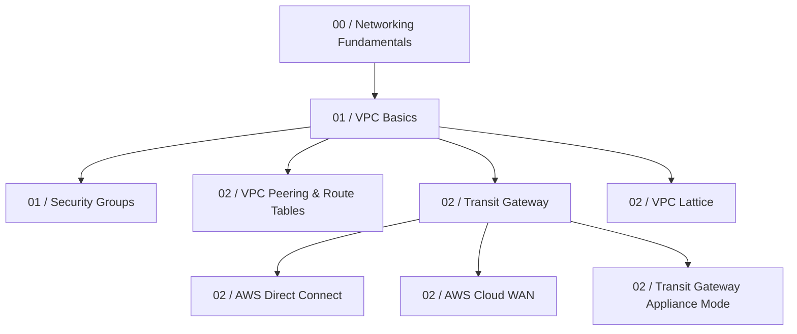
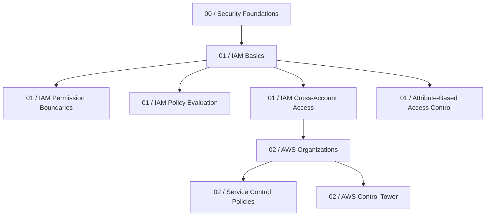
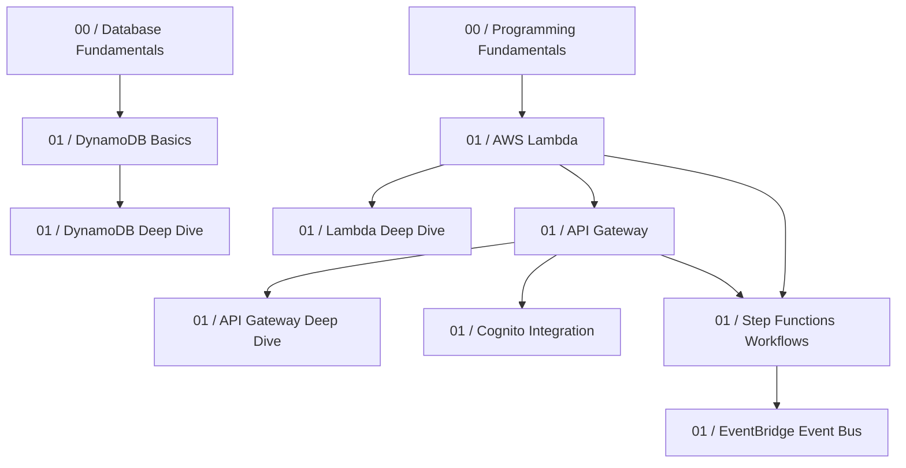

# AWS Study Library - Content Dependency Map

This map outlines the prerequisites, related concepts, and learning sequence across all domains of the AWS Study Library.

## 1. Network & Private Connectivity Flow

## 2. Identity, Access Control & Multi-Account Security

## 3. Serverless & Microservices Integration

## 4. Key Topic Prerequisites Table

| Topic / Service | Primary Prerequisite | Category | Difficulty |
| :--- | :--- | :--- | :--- |
| [Phase 0: Foundation Bridge Overview](file:///C:/Users/SST/StudyMaterial/aws-sap/docs/00-it-foundation/0-intro.md) | None | 0-intro.md | Beginner |
| [Module 1: How Computers Actually Work](file:///C:/Users/SST/StudyMaterial/aws-sap/docs/00-it-foundation/1-how-computers-work.md) | None | 1-how-computers-work.md | Beginner |
| [Module 1: Linux Fundamentals](file:///C:/Users/SST/StudyMaterial/aws-sap/docs/00-it-foundation/2-linux-fundamentals.md) | None | 2-linux-fundamentals.md | Beginner |
| [Module 1: Networking Fundamentals](file:///C:/Users/SST/StudyMaterial/aws-sap/docs/00-it-foundation/3-networking-fundamentals.md) | None | 3-networking-fundamentals.md | Beginner |
| [Module 1: Programming Fundamentals](file:///C:/Users/SST/StudyMaterial/aws-sap/docs/00-it-foundation/4-programming-fundamentals.md) | None | 4-programming-fundamentals.md | Beginner |
| [Module 1: Database Fundamentals](file:///C:/Users/SST/StudyMaterial/aws-sap/docs/00-it-foundation/5-databases.md) | None | 5-databases.md | Beginner |
| [Module 1: Web Application Fundamentals](file:///C:/Users/SST/StudyMaterial/aws-sap/docs/00-it-foundation/6-web-application-fundamentals.md) | None | 6-web-application-fundamentals.md | Beginner |
| [Module 1: Servers & Infrastructure](file:///C:/Users/SST/StudyMaterial/aws-sap/docs/00-it-foundation/7-servers-infrastructure.md) | None | 7-servers-infrastructure.md | Beginner |
| [Module 1: DevOps Foundations](file:///C:/Users/SST/StudyMaterial/aws-sap/docs/00-it-foundation/8-devops-foundations.md) | None | 8-devops-foundations.md | Beginner |
| [Module 1: Security Foundations](file:///C:/Users/SST/StudyMaterial/aws-sap/docs/00-it-foundation/9-security-foundations.md) | None | 9-security-foundations.md | Beginner |
| [Beginner Study Roadmap](file:///C:/Users/SST/StudyMaterial/aws-sap/docs/00-it-foundation/beginner-roadmap.md) | None | beginner-roadmap.md | Beginner |
| [ASG: Auto Scaling Group](file:///C:/Users/SST/StudyMaterial/aws-sap/docs/01-developer-associate/1-aws-fundamentals/asg.md) | 00-it-foundation | 1-aws-fundamentals | Associate |
| [EBS Volume](file:///C:/Users/SST/StudyMaterial/aws-sap/docs/01-developer-associate/1-aws-fundamentals/ebs.md) | 00-it-foundation | 1-aws-fundamentals | Associate |
| [EC2: Virtual Machines](file:///C:/Users/SST/StudyMaterial/aws-sap/docs/01-developer-associate/1-aws-fundamentals/ec2.md) | 00-it-foundation | 1-aws-fundamentals | Associate |
| [ElastiCache](file:///C:/Users/SST/StudyMaterial/aws-sap/docs/01-developer-associate/1-aws-fundamentals/elasticache.md) | 00-it-foundation | 1-aws-fundamentals | Associate |
| [ELB: Elastic Load Balancers](file:///C:/Users/SST/StudyMaterial/aws-sap/docs/01-developer-associate/1-aws-fundamentals/elb.md) | 00-it-foundation | 1-aws-fundamentals | Associate |
| [IAM: Identity and Access Management](file:///C:/Users/SST/StudyMaterial/aws-sap/docs/01-developer-associate/1-aws-fundamentals/iam.md) | 00-it-foundation | 1-aws-fundamentals | Associate |
| [RDS: Relational Database Service](file:///C:/Users/SST/StudyMaterial/aws-sap/docs/01-developer-associate/1-aws-fundamentals/rds.md) | 00-it-foundation | 1-aws-fundamentals | Associate |
| [Route 53](file:///C:/Users/SST/StudyMaterial/aws-sap/docs/01-developer-associate/1-aws-fundamentals/route53.md) | 00-it-foundation | 1-aws-fundamentals | Associate |
| [S3 Buckets](file:///C:/Users/SST/StudyMaterial/aws-sap/docs/01-developer-associate/1-aws-fundamentals/s3.md) | 00-it-foundation | 1-aws-fundamentals | Associate |
| [Security Groups](file:///C:/Users/SST/StudyMaterial/aws-sap/docs/01-developer-associate/1-aws-fundamentals/security-groups.md) | 00-it-foundation | 1-aws-fundamentals | Associate |
| [VPC: Virtual Private Cloud](file:///C:/Users/SST/StudyMaterial/aws-sap/docs/01-developer-associate/1-aws-fundamentals/vpc.md) | 00-it-foundation | 1-aws-fundamentals | Associate |
| [AWS AppConfig](file:///C:/Users/SST/StudyMaterial/aws-sap/docs/01-developer-associate/2-aws-deep-dive/appconfig.md) | 00-it-foundation | 2-aws-deep-dive | Associate |
| [CICD: Continuous Integration and Deployment](file:///C:/Users/SST/StudyMaterial/aws-sap/docs/01-developer-associate/2-aws-deep-dive/cicd/cicd.md) | 00-it-foundation | 2-aws-deep-dive | Associate |
| [CodeBuild](file:///C:/Users/SST/StudyMaterial/aws-sap/docs/01-developer-associate/2-aws-deep-dive/cicd/codebuild.md) | 00-it-foundation | 2-aws-deep-dive | Associate |
| [codecommit](file:///C:/Users/SST/StudyMaterial/aws-sap/docs/01-developer-associate/2-aws-deep-dive/cicd/codecommit.md) | 00-it-foundation | 2-aws-deep-dive | Associate |
| [CodeDeploy](file:///C:/Users/SST/StudyMaterial/aws-sap/docs/01-developer-associate/2-aws-deep-dive/cicd/codedeploy.md) | 00-it-foundation | 2-aws-deep-dive | Associate |
| [CodePipeline](file:///C:/Users/SST/StudyMaterial/aws-sap/docs/01-developer-associate/2-aws-deep-dive/cicd/codepipeline.md) | 00-it-foundation | 2-aws-deep-dive | Associate |
| [CLI: Command Line Interface](file:///C:/Users/SST/StudyMaterial/aws-sap/docs/01-developer-associate/2-aws-deep-dive/cli.md) | 00-it-foundation | 2-aws-deep-dive | Associate |
| [AWS Cloud9 IDE](file:///C:/Users/SST/StudyMaterial/aws-sap/docs/01-developer-associate/2-aws-deep-dive/cloud9.md) | 00-it-foundation | 2-aws-deep-dive | Associate |
| [CloudFormation](file:///C:/Users/SST/StudyMaterial/aws-sap/docs/01-developer-associate/2-aws-deep-dive/cloudformation/cloudformation.md) | 00-it-foundation | 2-aws-deep-dive | Associate |
| [Cloudfront](file:///C:/Users/SST/StudyMaterial/aws-sap/docs/01-developer-associate/2-aws-deep-dive/cloudfront.md) | 00-it-foundation | 2-aws-deep-dive | Associate |
| [AWS CloudShell](file:///C:/Users/SST/StudyMaterial/aws-sap/docs/01-developer-associate/2-aws-deep-dive/cloudshell.md) | 00-it-foundation | 2-aws-deep-dive | Associate |
| [AWS CodeArtifact](file:///C:/Users/SST/StudyMaterial/aws-sap/docs/01-developer-associate/2-aws-deep-dive/codeartifact.md) | 00-it-foundation | 2-aws-deep-dive | Associate |
| [Amazon CodeCatalyst](file:///C:/Users/SST/StudyMaterial/aws-sap/docs/01-developer-associate/2-aws-deep-dive/codecatalyst.md) | 00-it-foundation | 2-aws-deep-dive | Associate |
| [Elastic Beanstalk](file:///C:/Users/SST/StudyMaterial/aws-sap/docs/01-developer-associate/2-aws-deep-dive/elastic-beanstalk.md) | 00-it-foundation | 2-aws-deep-dive | Associate |
| [IAM Attribute-Based Access Control (ABAC)](file:///C:/Users/SST/StudyMaterial/aws-sap/docs/01-developer-associate/2-aws-deep-dive/iam-deep-dive/iam-abac.md) | 00-it-foundation | 2-aws-deep-dive | Associate |
| [IAM Access Analyzer](file:///C:/Users/SST/StudyMaterial/aws-sap/docs/01-developer-associate/2-aws-deep-dive/iam-deep-dive/iam-access-analyzer.md) | 00-it-foundation | 2-aws-deep-dive | Associate |
| [IAM Cross-Account Access](file:///C:/Users/SST/StudyMaterial/aws-sap/docs/01-developer-associate/2-aws-deep-dive/iam-deep-dive/iam-cross-account-access.md) | 00-it-foundation | 2-aws-deep-dive | Associate |
| [IAM Permission Boundaries](file:///C:/Users/SST/StudyMaterial/aws-sap/docs/01-developer-associate/2-aws-deep-dive/iam-deep-dive/iam-permission-boundaries.md) | 00-it-foundation | 2-aws-deep-dive | Associate |
| [IAM Policy Evaluation Logic](file:///C:/Users/SST/StudyMaterial/aws-sap/docs/01-developer-associate/2-aws-deep-dive/iam-deep-dive/iam-policy-evaluation.md) | 00-it-foundation | 2-aws-deep-dive | Associate |
| [Integration and Messaging](file:///C:/Users/SST/StudyMaterial/aws-sap/docs/01-developer-associate/2-aws-deep-dive/integration-and-messaging/0-intro.md) | 00-it-foundation | 2-aws-deep-dive | Associate |
| [SQS: Simple Queue Service](file:///C:/Users/SST/StudyMaterial/aws-sap/docs/01-developer-associate/2-aws-deep-dive/integration-and-messaging/1-sqs.md) | 00-it-foundation | 2-aws-deep-dive | Associate |
| [SNS: Simple Notification Service](file:///C:/Users/SST/StudyMaterial/aws-sap/docs/01-developer-associate/2-aws-deep-dive/integration-and-messaging/2-sns.md) | 00-it-foundation | 2-aws-deep-dive | Associate |
| [Kinesis](file:///C:/Users/SST/StudyMaterial/aws-sap/docs/01-developer-associate/2-aws-deep-dive/integration-and-messaging/3-kinesis.md) | 00-it-foundation | 2-aws-deep-dive | Associate |
| [Difference between Config / CloudWatch / CloudTrail](file:///C:/Users/SST/StudyMaterial/aws-sap/docs/01-developer-associate/2-aws-deep-dive/monitoring-and-audit/cloudsomething_difference.md) | 00-it-foundation | 2-aws-deep-dive | Associate |
| [AWS CloudTrail](file:///C:/Users/SST/StudyMaterial/aws-sap/docs/01-developer-associate/2-aws-deep-dive/monitoring-and-audit/cloudtrail.md) | 00-it-foundation | 2-aws-deep-dive | Associate |
| [CloudWatch Advanced](file:///C:/Users/SST/StudyMaterial/aws-sap/docs/01-developer-associate/2-aws-deep-dive/monitoring-and-audit/cloudwatch-advanced.md) | 00-it-foundation | 2-aws-deep-dive | Associate |
| [CloudWatch](file:///C:/Users/SST/StudyMaterial/aws-sap/docs/01-developer-associate/2-aws-deep-dive/monitoring-and-audit/cloudwatch.md) | 00-it-foundation | 2-aws-deep-dive | Associate |
| [AWS Config](file:///C:/Users/SST/StudyMaterial/aws-sap/docs/01-developer-associate/2-aws-deep-dive/monitoring-and-audit/config.md) | 00-it-foundation | 2-aws-deep-dive | Associate |
| [AWS X-Ray Advanced](file:///C:/Users/SST/StudyMaterial/aws-sap/docs/01-developer-associate/2-aws-deep-dive/monitoring-and-audit/xray-advanced.md) | 00-it-foundation | 2-aws-deep-dive | Associate |
| [AWS X-Ray](file:///C:/Users/SST/StudyMaterial/aws-sap/docs/01-developer-associate/2-aws-deep-dive/monitoring-and-audit/xray.md) | 00-it-foundation | 2-aws-deep-dive | Associate |
| [SDK: Software Development Kit](file:///C:/Users/SST/StudyMaterial/aws-sap/docs/01-developer-associate/2-aws-deep-dive/sdk.md) | 00-it-foundation | 2-aws-deep-dive | Associate |
| [YAML Crash Course](file:///C:/Users/SST/StudyMaterial/aws-sap/docs/01-developer-associate/2-aws-deep-dive/yaml.md) | 00-it-foundation | 2-aws-deep-dive | Associate |
| [API Gateway Deep Dive](file:///C:/Users/SST/StudyMaterial/aws-sap/docs/01-developer-associate/3-aws-serverless/api-gateway-advanced.md) | 00-it-foundation | 3-aws-serverless | Associate |
| [API Gateway](file:///C:/Users/SST/StudyMaterial/aws-sap/docs/01-developer-associate/3-aws-serverless/apigateway.md) | 00-it-foundation | 3-aws-serverless | Associate |
| [AWS AppSync](file:///C:/Users/SST/StudyMaterial/aws-sap/docs/01-developer-associate/3-aws-serverless/appsync.md) | 00-it-foundation | 3-aws-serverless | Associate |
| [Cognito](file:///C:/Users/SST/StudyMaterial/aws-sap/docs/01-developer-associate/3-aws-serverless/cognito.md) | 00-it-foundation | 3-aws-serverless | Associate |
| [DynamoDB Deep Dive](file:///C:/Users/SST/StudyMaterial/aws-sap/docs/01-developer-associate/3-aws-serverless/dynamodb-advanced.md) | 00-it-foundation | 3-aws-serverless | Associate |
| [DynamoDB](file:///C:/Users/SST/StudyMaterial/aws-sap/docs/01-developer-associate/3-aws-serverless/dynamodb.md) | 00-it-foundation | 3-aws-serverless | Associate |
| [Amazon EventBridge](file:///C:/Users/SST/StudyMaterial/aws-sap/docs/01-developer-associate/3-aws-serverless/eventbridge-deep-dive.md) | 00-it-foundation | 3-aws-serverless | Associate |
| [AWS Lambda Deep Dive](file:///C:/Users/SST/StudyMaterial/aws-sap/docs/01-developer-associate/3-aws-serverless/lambda-advanced.md) | 00-it-foundation | 3-aws-serverless | Associate |
| [AWS Lambda](file:///C:/Users/SST/StudyMaterial/aws-sap/docs/01-developer-associate/3-aws-serverless/lambda.md) | 00-it-foundation | 3-aws-serverless | Associate |
| [AWS SAM](file:///C:/Users/SST/StudyMaterial/aws-sap/docs/01-developer-associate/3-aws-serverless/sam.md) | 00-it-foundation | 3-aws-serverless | Associate |
| [AWS Serverless](file:///C:/Users/SST/StudyMaterial/aws-sap/docs/01-developer-associate/3-aws-serverless/serverless.md) | 00-it-foundation | 3-aws-serverless | Associate |
| [AWS Step Functions](file:///C:/Users/SST/StudyMaterial/aws-sap/docs/01-developer-associate/3-aws-serverless/stepfunctions.md) | 00-it-foundation | 3-aws-serverless | Associate |
| [ecr](file:///C:/Users/SST/StudyMaterial/aws-sap/docs/01-developer-associate/4-aws-containers/ecr.md) | 00-it-foundation | 4-aws-containers | Associate |
| [ECS Auto Scaling](file:///C:/Users/SST/StudyMaterial/aws-sap/docs/01-developer-associate/4-aws-containers/ecs-autoscaling.md) | 00-it-foundation | 4-aws-containers | Associate |
| [ECS Capacity Providers](file:///C:/Users/SST/StudyMaterial/aws-sap/docs/01-developer-associate/4-aws-containers/ecs-capacity-providers.md) | 00-it-foundation | 4-aws-containers | Associate |
| [ecs](file:///C:/Users/SST/StudyMaterial/aws-sap/docs/01-developer-associate/4-aws-containers/ecs.md) | 00-it-foundation | 4-aws-containers | Associate |
| [EKS Fundamentals](file:///C:/Users/SST/StudyMaterial/aws-sap/docs/01-developer-associate/4-aws-containers/eks-fundamentals.md) | 00-it-foundation | 4-aws-containers | Associate |
| [fargate](file:///C:/Users/SST/StudyMaterial/aws-sap/docs/01-developer-associate/4-aws-containers/fargate.md) | 00-it-foundation | 4-aws-containers | Associate |
| [AWS Cognito Integration](file:///C:/Users/SST/StudyMaterial/aws-sap/docs/01-developer-associate/5-others/cognito.md) | 00-it-foundation | 5-others | Associate |
| [JWT and Authentication](file:///C:/Users/SST/StudyMaterial/aws-sap/docs/01-developer-associate/5-others/jwt-and-authentication.md) | 00-it-foundation | 5-others | Associate |
| [KMS](file:///C:/Users/SST/StudyMaterial/aws-sap/docs/01-developer-associate/5-others/kms.md) | 00-it-foundation | 5-others | Associate |
| [Parameter Store vs Secrets Manager](file:///C:/Users/SST/StudyMaterial/aws-sap/docs/01-developer-associate/5-others/parameter-store-vs-secrets-manager.md) | 00-it-foundation | 5-others | Associate |
| [Secret Manager and System Parameters](file:///C:/Users/SST/StudyMaterial/aws-sap/docs/01-developer-associate/5-others/secret-manager.md) | 00-it-foundation | 5-others | Associate |
| [Signature Version 4 (SigV4)](file:///C:/Users/SST/StudyMaterial/aws-sap/docs/01-developer-associate/5-others/sigv4.md) | 00-it-foundation | 5-others | Associate |
| [DVA Study Plan & Roadmap](file:///C:/Users/SST/StudyMaterial/aws-sap/docs/01-developer-associate/dva-roadmap.md) | 00-it-foundation | dva-roadmap.md | Associate |
| [DVA-C02 Full Mock Exam 2 - Part 1 (Questions 1-25)](file:///C:/Users/SST/StudyMaterial/aws-sap/docs/01-developer-associate/Practice Exams/DVA-C02-Mock-Exam-2-Part-1.md) | 00-it-foundation | Practice Exams | Associate |
| [DVA-C02 Full Mock Exam 2 - Part 2 (Questions 26-50)](file:///C:/Users/SST/StudyMaterial/aws-sap/docs/01-developer-associate/Practice Exams/DVA-C02-Mock-Exam-2-Part-2.md) | 00-it-foundation | Practice Exams | Associate |
| [DVA-C02 Full Mock Exam 2 - Part 3 (Questions 51-75)](file:///C:/Users/SST/StudyMaterial/aws-sap/docs/01-developer-associate/Practice Exams/DVA-C02-Mock-Exam-2-Part-3.md) | 00-it-foundation | Practice Exams | Associate |
| [DVA-C02 Full Mock Exam 3 - Part 1 (Questions 1-25)](file:///C:/Users/SST/StudyMaterial/aws-sap/docs/01-developer-associate/Practice Exams/DVA-C02-Mock-Exam-3-Part-1.md) | 00-it-foundation | Practice Exams | Associate |
| [DVA-C02 Full Mock Exam 3 - Part 2 (Questions 26-50)](file:///C:/Users/SST/StudyMaterial/aws-sap/docs/01-developer-associate/Practice Exams/DVA-C02-Mock-Exam-3-Part-2.md) | 00-it-foundation | Practice Exams | Associate |
| [DVA-C02 Full Mock Exam 3 - Part 3 (Questions 51-75)](file:///C:/Users/SST/StudyMaterial/aws-sap/docs/01-developer-associate/Practice Exams/DVA-C02-Mock-Exam-3-Part-3.md) | 00-it-foundation | Practice Exams | Associate |
| [DVA-C02 Full Mock Exam - Part 1 (Questions 1-25)](file:///C:/Users/SST/StudyMaterial/aws-sap/docs/01-developer-associate/Practice Exams/DVA-C02-Mock-Exam-Part-1.md) | 00-it-foundation | Practice Exams | Associate |
| [DVA-C02 Full Mock Exam - Part 2 (Questions 26-50)](file:///C:/Users/SST/StudyMaterial/aws-sap/docs/01-developer-associate/Practice Exams/DVA-C02-Mock-Exam-Part-2.md) | 00-it-foundation | Practice Exams | Associate |
| [DVA-C02 Full Mock Exam - Part 3 (Questions 51-75)](file:///C:/Users/SST/StudyMaterial/aws-sap/docs/01-developer-associate/Practice Exams/DVA-C02-Mock-Exam-Part-3.md) | 00-it-foundation | Practice Exams | Associate |
| [AWS Certified Developer – Associate (DVA-C02) Practice Mock Exams](file:///C:/Users/SST/StudyMaterial/aws-sap/docs/01-developer-associate/Practice Exams/DVA-C02-Mock-Exam.md) | 00-it-foundation | Practice Exams | Associate |
| [AWS Data Exchange](file:///C:/Users/SST/StudyMaterial/aws-sap/docs/02-solutions-architect-professional/Analytics/Data Integration & Management/AWS Data Exchange.md) | 01-developer-associate | Analytics | Professional |
| [AWS Glue](file:///C:/Users/SST/StudyMaterial/aws-sap/docs/02-solutions-architect-professional/Analytics/Data Integration & Management/AWS Glue.md) | 01-developer-associate | Analytics | Professional |
| [AWS Lake Formation](file:///C:/Users/SST/StudyMaterial/aws-sap/docs/02-solutions-architect-professional/Analytics/Data Integration & Management/AWS Lake Formation.md) | 01-developer-associate | Analytics | Professional |
| [Amazon Athena](file:///C:/Users/SST/StudyMaterial/aws-sap/docs/02-solutions-architect-professional/Analytics/Interactive Query & Batch Processing/Amazon Athena.md) | 01-developer-associate | Analytics | Professional |
| [Amazon EMR](file:///C:/Users/SST/StudyMaterial/aws-sap/docs/02-solutions-architect-professional/Analytics/Interactive Query & Batch Processing/Amazon EMR.md) | 01-developer-associate | Analytics | Professional |
| [Amazon OpenSearch Service](file:///C:/Users/SST/StudyMaterial/aws-sap/docs/02-solutions-architect-professional/Analytics/opensearch.md) | 01-developer-associate | Analytics | Professional |
| [Kinesis Data Firehose](file:///C:/Users/SST/StudyMaterial/aws-sap/docs/02-solutions-architect-professional/Analytics/Streaming Data & Real-Time Analytics/Amazon Data Firehose.md) | 01-developer-associate | Analytics | Professional |
| [Amazon Kinesis Data Streams](file:///C:/Users/SST/StudyMaterial/aws-sap/docs/02-solutions-architect-professional/Analytics/Streaming Data & Real-Time Analytics/Amazon Kinesis Data Streams.md) | 01-developer-associate | Analytics | Professional |
| [Amazon Managed Service for Apache Flink](file:///C:/Users/SST/StudyMaterial/aws-sap/docs/02-solutions-architect-professional/Analytics/Streaming Data & Real-Time Analytics/Amazon Managed Service for Apache Flink.md) | 01-developer-associate | Analytics | Professional |
| [Amazon Managed Streaming for Apache Kafka (Amazon MSK)](file:///C:/Users/SST/StudyMaterial/aws-sap/docs/02-solutions-architect-professional/Analytics/Streaming Data & Real-Time Analytics/Amazon Managed Streaming for Apache Kafka.md) | 01-developer-associate | Analytics | Professional |
| [Amazon OpenSearch Serverless](file:///C:/Users/SST/StudyMaterial/aws-sap/docs/02-solutions-architect-professional/Analytics/Visualization & Search/Amazon OpenSearch Serverless.md) | 01-developer-associate | Analytics | Professional |
| [Amazon OpenSearch](file:///C:/Users/SST/StudyMaterial/aws-sap/docs/02-solutions-architect-professional/Analytics/Visualization & Search/Amazon OpenSearch.md) | 01-developer-associate | Analytics | Professional |
| [Amazon QuickSight](file:///C:/Users/SST/StudyMaterial/aws-sap/docs/02-solutions-architect-professional/Analytics/Visualization & Search/Amazon QuickSight.md) | 01-developer-associate | Analytics | Professional |
| [Amazon Managed Streaming for Apache Kafka (MSK)](file:///C:/Users/SST/StudyMaterial/aws-sap/docs/02-solutions-architect-professional/Application Integration/amazon-msk.md) | 01-developer-associate | Application Integration | Professional |
| [AWS AppSync](file:///C:/Users/SST/StudyMaterial/aws-sap/docs/02-solutions-architect-professional/Application Integration/API & Workflow Integration/AWS AppSync.md) | 01-developer-associate | Application Integration | Professional |
| [AWS Step Functions](file:///C:/Users/SST/StudyMaterial/aws-sap/docs/02-solutions-architect-professional/Application Integration/API & Workflow Integration/AWS Step Functions.md) | 01-developer-associate | Application Integration | Professional |
| [Amazon AppFlow](file:///C:/Users/SST/StudyMaterial/aws-sap/docs/02-solutions-architect-professional/Application Integration/appflow.md) | 01-developer-associate | Application Integration | Professional |
| [Amazon EventBridge](file:///C:/Users/SST/StudyMaterial/aws-sap/docs/02-solutions-architect-professional/Application Integration/Messaging & Eventing/Amazon EventBridge.md) | 01-developer-associate | Application Integration | Professional |
| [Amazon MQ](file:///C:/Users/SST/StudyMaterial/aws-sap/docs/02-solutions-architect-professional/Application Integration/Messaging & Eventing/Amazon MQ.md) | 01-developer-associate | Application Integration | Professional |
| [Amazon SNS](file:///C:/Users/SST/StudyMaterial/aws-sap/docs/02-solutions-architect-professional/Application Integration/Messaging & Eventing/Amazon SNS.md) | 01-developer-associate | Application Integration | Professional |
| [Amazon SQS](file:///C:/Users/SST/StudyMaterial/aws-sap/docs/02-solutions-architect-professional/Application Integration/Messaging & Eventing/Amazon SQS.md) | 01-developer-associate | Application Integration | Professional |
| [Amazon Managed Blockchain](file:///C:/Users/SST/StudyMaterial/aws-sap/docs/02-solutions-architect-professional/Blockchain/Amazon Managed Blockchain.md) | 01-developer-associate | Blockchain | Professional |
| [Amazon Connect](file:///C:/Users/SST/StudyMaterial/aws-sap/docs/02-solutions-architect-professional/Business Applications/Contact Center & Email/Amazon Connect.md) | 01-developer-associate | Business Applications | Professional |
| [Amazon Simple Email Service (SES)](file:///C:/Users/SST/StudyMaterial/aws-sap/docs/02-solutions-architect-professional/Business Applications/Contact Center & Email/Amazon SES.md) | 01-developer-associate | Business Applications | Professional |
| [AWS Alexa for Business](file:///C:/Users/SST/StudyMaterial/aws-sap/docs/02-solutions-architect-professional/Business Applications/Voice & Collaboration/AWS Alexa for Business.md) | 01-developer-associate | Business Applications | Professional |
| [Chargeback & Showback Methodologies](file:///C:/Users/SST/StudyMaterial/aws-sap/docs/02-solutions-architect-professional/Cloud Financial Management/chargeback-showback.md) | 01-developer-associate | Cloud Financial Management | Professional |
| [AWS Cost Allocation Tags](file:///C:/Users/SST/StudyMaterial/aws-sap/docs/02-solutions-architect-professional/Cloud Financial Management/Cost Allocation & Savings/AWS Cost Allocation Tags.md) | 01-developer-associate | Cloud Financial Management | Professional |
| [Savings Plans](file:///C:/Users/SST/StudyMaterial/aws-sap/docs/02-solutions-architect-professional/Cloud Financial Management/Cost Allocation & Savings/Savings Plans.md) | 01-developer-associate | Cloud Financial Management | Professional |
| [AWS Budgets](file:///C:/Users/SST/StudyMaterial/aws-sap/docs/02-solutions-architect-professional/Cloud Financial Management/Cost Monitoring & Budgeting/AWS Budgets.md) | 01-developer-associate | Cloud Financial Management | Professional |
| [AWS Cost Explorer](file:///C:/Users/SST/StudyMaterial/aws-sap/docs/02-solutions-architect-professional/Cloud Financial Management/Cost Monitoring & Budgeting/AWS Cost Explorer.md) | 01-developer-associate | Cloud Financial Management | Professional |
| [Cost Allocation Tags](file:///C:/Users/SST/StudyMaterial/aws-sap/docs/02-solutions-architect-professional/Cloud Financial Management/cost-allocation-tags.md) | 01-developer-associate | Cloud Financial Management | Professional |
| [AWS Cost & Usage Report (CUR)](file:///C:/Users/SST/StudyMaterial/aws-sap/docs/02-solutions-architect-professional/Cloud Financial Management/cost-and-usage-reports.md) | 01-developer-associate | Cloud Financial Management | Professional |
| [Reserved Instance (RI) Strategy](file:///C:/Users/SST/StudyMaterial/aws-sap/docs/02-solutions-architect-professional/Cloud Financial Management/reserved-instance-strategy.md) | 01-developer-associate | Cloud Financial Management | Professional |
| [Savings Plans Modeling & Purchase](file:///C:/Users/SST/StudyMaterial/aws-sap/docs/02-solutions-architect-professional/Cloud Financial Management/savings-plans-modeling.md) | 01-developer-associate | Cloud Financial Management | Professional |
| [On-Demand Capacity Reservations](file:///C:/Users/SST/StudyMaterial/aws-sap/docs/02-solutions-architect-professional/Compute/capacity-reservations.md) | 01-developer-associate | Compute | Professional |
| [Dedicated Hosts](file:///C:/Users/SST/StudyMaterial/aws-sap/docs/02-solutions-architect-professional/Compute/dedicated-hosts.md) | 01-developer-associate | Compute | Professional |
| [EC2 Launch Templates](file:///C:/Users/SST/StudyMaterial/aws-sap/docs/02-solutions-architect-professional/Compute/launch-templates.md) | 01-developer-associate | Compute | Professional |
| [AWS Local Zones](file:///C:/Users/SST/StudyMaterial/aws-sap/docs/02-solutions-architect-professional/Compute/local-zones.md) | 01-developer-associate | Compute | Professional |
| [EC2 Placement Groups](file:///C:/Users/SST/StudyMaterial/aws-sap/docs/02-solutions-architect-professional/Compute/placement-groups.md) | 01-developer-associate | Compute | Professional |
| [AWS Auto Scaling](file:///C:/Users/SST/StudyMaterial/aws-sap/docs/02-solutions-architect-professional/Compute/Scaling & Batch Processing/AWS Auto Scaling.md) | 01-developer-associate | Compute | Professional |
| [AWS Batch](file:///C:/Users/SST/StudyMaterial/aws-sap/docs/02-solutions-architect-professional/Compute/Scaling & Batch Processing/AWS Batch.md) | 01-developer-associate | Compute | Professional |
| [AWS App Runner](file:///C:/Users/SST/StudyMaterial/aws-sap/docs/02-solutions-architect-professional/Compute/Serverless & Managed Compute/AWS App Runner.md) | 01-developer-associate | Compute | Professional |
| [AWS Elastic Beanstalk](file:///C:/Users/SST/StudyMaterial/aws-sap/docs/02-solutions-architect-professional/Compute/Serverless & Managed Compute/AWS Elastic Beanstalk.md) | 01-developer-associate | Compute | Professional |
| [AWS Lambda](file:///C:/Users/SST/StudyMaterial/aws-sap/docs/02-solutions-architect-professional/Compute/Serverless & Managed Compute/AWS Lambda.md) | 01-developer-associate | Compute | Professional |
| [Amazon Lightsail](file:///C:/Users/SST/StudyMaterial/aws-sap/docs/02-solutions-architect-professional/Compute/Simplified Compute/Amazon Lightsail.md) | 01-developer-associate | Compute | Professional |
| [Spot Fleet](file:///C:/Users/SST/StudyMaterial/aws-sap/docs/02-solutions-architect-professional/Compute/spot-fleet.md) | 01-developer-associate | Compute | Professional |
| [AWS Outposts](file:///C:/Users/SST/StudyMaterial/aws-sap/docs/02-solutions-architect-professional/Compute/Virtual Machines & Infrastructure/AWS Outposts.md) | 01-developer-associate | Compute | Professional |
| [AWS Wavelength](file:///C:/Users/SST/StudyMaterial/aws-sap/docs/02-solutions-architect-professional/Compute/Virtual Machines & Infrastructure/AWS Wavelength.md) | 01-developer-associate | Compute | Professional |
| [Amazon EC2 - Auto Scaling](file:///C:/Users/SST/StudyMaterial/aws-sap/docs/02-solutions-architect-professional/Compute/Virtual Machines & Infrastructure/EC2/Amazon EC2 - Auto Scaling.md) | 01-developer-associate | Compute | Professional |
| [Amazon EC2 - Fleets](file:///C:/Users/SST/StudyMaterial/aws-sap/docs/02-solutions-architect-professional/Compute/Virtual Machines & Infrastructure/EC2/Amazon EC2 - Fleets.md) | 01-developer-associate | Compute | Professional |
| [Amazon EC2 - Monitoring](file:///C:/Users/SST/StudyMaterial/aws-sap/docs/02-solutions-architect-professional/Compute/Virtual Machines & Infrastructure/EC2/Amazon EC2 - Monitoring.md) | 01-developer-associate | Compute | Professional |
| [Amazon EC2 - Networking](file:///C:/Users/SST/StudyMaterial/aws-sap/docs/02-solutions-architect-professional/Compute/Virtual Machines & Infrastructure/EC2/Amazon EC2 - Networking.md) | 01-developer-associate | Compute | Professional |
| [Amazon EC2 - Security](file:///C:/Users/SST/StudyMaterial/aws-sap/docs/02-solutions-architect-professional/Compute/Virtual Machines & Infrastructure/EC2/Amazon EC2 - Security.md) | 01-developer-associate | Compute | Professional |
| [Amazon EC2](file:///C:/Users/SST/StudyMaterial/aws-sap/docs/02-solutions-architect-professional/Compute/Virtual Machines & Infrastructure/EC2/Amazon EC2.md) | 01-developer-associate | Compute | Professional |
| [EC2 Image Builder](file:///C:/Users/SST/StudyMaterial/aws-sap/docs/02-solutions-architect-professional/Compute/Virtual Machines & Infrastructure/EC2 Image Builder.md) | 01-developer-associate | Compute | Professional |
| [Auto Scaling Warm Pools](file:///C:/Users/SST/StudyMaterial/aws-sap/docs/02-solutions-architect-professional/Compute/warm-pools.md) | 01-developer-associate | Compute | Professional |
| [AWS App Mesh](file:///C:/Users/SST/StudyMaterial/aws-sap/docs/02-solutions-architect-professional/Containers/app-mesh.md) | 01-developer-associate | Containers | Professional |
| [Amazon ECS](file:///C:/Users/SST/StudyMaterial/aws-sap/docs/02-solutions-architect-professional/Containers/Container Orchestration/Amazon ECS.md) | 01-developer-associate | Containers | Professional |
| [Amazon EKS](file:///C:/Users/SST/StudyMaterial/aws-sap/docs/02-solutions-architect-professional/Containers/Container Orchestration/Amazon EKS.md) | 01-developer-associate | Containers | Professional |
| [Amazon ECR](file:///C:/Users/SST/StudyMaterial/aws-sap/docs/02-solutions-architect-professional/Containers/Container Registry/Amazon ECR.md) | 01-developer-associate | Containers | Professional |
| [EKS Control Plane & Worker Nodes](file:///C:/Users/SST/StudyMaterial/aws-sap/docs/02-solutions-architect-professional/Containers/eks-architecture.md) | 01-developer-associate | Containers | Professional |
| [EKS Pod Networking (VPC CNI)](file:///C:/Users/SST/StudyMaterial/aws-sap/docs/02-solutions-architect-professional/Containers/eks-networking.md) | 01-developer-associate | Containers | Professional |
| [EKS Security & IRSA](file:///C:/Users/SST/StudyMaterial/aws-sap/docs/02-solutions-architect-professional/Containers/eks-security.md) | 01-developer-associate | Containers | Professional |
| [EKS Ingress Controllers](file:///C:/Users/SST/StudyMaterial/aws-sap/docs/02-solutions-architect-professional/Containers/ingress-controllers.md) | 01-developer-associate | Containers | Professional |
| [Amazon Aurora Backtracking](file:///C:/Users/SST/StudyMaterial/aws-sap/docs/02-solutions-architect-professional/Database/aurora-backtracking.md) | 01-developer-associate | Database | Professional |
| [Amazon Aurora Fast Database Cloning](file:///C:/Users/SST/StudyMaterial/aws-sap/docs/02-solutions-architect-professional/Database/aurora-cloning.md) | 01-developer-associate | Database | Professional |
| [Amazon Aurora Serverless v2](file:///C:/Users/SST/StudyMaterial/aws-sap/docs/02-solutions-architect-professional/Database/aurora-serverless.md) | 01-developer-associate | Database | Professional |
| [Amazon DynamoDB Accelerator (DAX)](file:///C:/Users/SST/StudyMaterial/aws-sap/docs/02-solutions-architect-professional/Database/dax.md) | 01-developer-associate | Database | Professional |
| [Amazon MemoryDB for Redis](file:///C:/Users/SST/StudyMaterial/aws-sap/docs/02-solutions-architect-professional/Database/memorydb.md) | 01-developer-associate | Database | Professional |
| [Amazon DocumentDB](file:///C:/Users/SST/StudyMaterial/aws-sap/docs/02-solutions-architect-professional/Database/NoSQL Databases/Amazon DocumentDB.md) | 01-developer-associate | Database | Professional |
| [Amazon DynamoDB](file:///C:/Users/SST/StudyMaterial/aws-sap/docs/02-solutions-architect-professional/Database/NoSQL Databases/Amazon DynamoDB.md) | 01-developer-associate | Database | Professional |
| [Amazon Keyspaces](file:///C:/Users/SST/StudyMaterial/aws-sap/docs/02-solutions-architect-professional/Database/NoSQL Databases/Amazon Keyspaces.md) | 01-developer-associate | Database | Professional |
| [Amazon RDS Proxy](file:///C:/Users/SST/StudyMaterial/aws-sap/docs/02-solutions-architect-professional/Database/rds-proxy.md) | 01-developer-associate | Database | Professional |
| [Amazon Aurora](file:///C:/Users/SST/StudyMaterial/aws-sap/docs/02-solutions-architect-professional/Database/Relational & Data Warehouse/Amazon Aurora.md) | 01-developer-associate | Database | Professional |
| [Amazon RDS](file:///C:/Users/SST/StudyMaterial/aws-sap/docs/02-solutions-architect-professional/Database/Relational & Data Warehouse/Amazon RDS.md) | 01-developer-associate | Database | Professional |
| [Amazon Redshift](file:///C:/Users/SST/StudyMaterial/aws-sap/docs/02-solutions-architect-professional/Database/Relational & Data Warehouse/Amazon Redshift.md) | 01-developer-associate | Database | Professional |
| [Amazon ElastiCache](file:///C:/Users/SST/StudyMaterial/aws-sap/docs/02-solutions-architect-professional/Database/Specialized & In-Memory/Amazon ElastiCache.md) | 01-developer-associate | Database | Professional |
| [Amazon Neptune](file:///C:/Users/SST/StudyMaterial/aws-sap/docs/02-solutions-architect-professional/Database/Specialized & In-Memory/Amazon Neptune.md) | 01-developer-associate | Database | Professional |
| [Amazon Timestream](file:///C:/Users/SST/StudyMaterial/aws-sap/docs/02-solutions-architect-professional/Database/Specialized & In-Memory/Amazon Timestream.md) | 01-developer-associate | Database | Professional |
| [Amazon CodeGuru](file:///C:/Users/SST/StudyMaterial/aws-sap/docs/02-solutions-architect-professional/Developer Tools/CICD & Code Quality/Amazon CodeGuru.md) | 01-developer-associate | Developer Tools | Professional |
| [AWS CodeBuild, AWS CodeDeploy, AWS CodePipeline, AWS CodeArtifact](file:///C:/Users/SST/StudyMaterial/aws-sap/docs/02-solutions-architect-professional/Developer Tools/CICD & Code Quality/AWS CodeBuild, AWS CodeDeploy, AWS CodePipeline, AWS CodeArtifact.md) | 01-developer-associate | Developer Tools | Professional |
| [AWS Fault Injection Simulator (FIS)](file:///C:/Users/SST/StudyMaterial/aws-sap/docs/02-solutions-architect-professional/Developer Tools/Observability & Testing/AWS Fault Injection Simulator.md) | 01-developer-associate | Developer Tools | Professional |
| [AWS X-Ray](file:///C:/Users/SST/StudyMaterial/aws-sap/docs/02-solutions-architect-professional/Developer Tools/Observability & Testing/AWS X-Ray.md) | 01-developer-associate | Developer Tools | Professional |
| [Amazon AppStream 2.0](file:///C:/Users/SST/StudyMaterial/aws-sap/docs/02-solutions-architect-professional/End User Computing/Amazon AppStream 2.0.md) | 01-developer-associate | End User Computing | Professional |
| [Amazon WorkSpaces](file:///C:/Users/SST/StudyMaterial/aws-sap/docs/02-solutions-architect-professional/End User Computing/Amazon WorkSpaces.md) | 01-developer-associate | End User Computing | Professional |
| [Amazon API Gateway](file:///C:/Users/SST/StudyMaterial/aws-sap/docs/02-solutions-architect-professional/Frontend Web & Mobile/API Management/Amazon API Gateway.md) | 01-developer-associate | Frontend Web & Mobile | Professional |
| [AWS Amplify](file:///C:/Users/SST/StudyMaterial/aws-sap/docs/02-solutions-architect-professional/Frontend Web & Mobile/Development Platforms/AWS Amplify.md) | 01-developer-associate | Frontend Web & Mobile | Professional |
| [AWS Device Farm](file:///C:/Users/SST/StudyMaterial/aws-sap/docs/02-solutions-architect-professional/Frontend Web & Mobile/Development Platforms/AWS Device Farm.md) | 01-developer-associate | Frontend Web & Mobile | Professional |
| [Amazon Pinpoint](file:///C:/Users/SST/StudyMaterial/aws-sap/docs/02-solutions-architect-professional/Frontend Web & Mobile/User Engagement/Amazon Pinpoint.md) | 01-developer-associate | Frontend Web & Mobile | Professional |
| [AWS IoT Services](file:///C:/Users/SST/StudyMaterial/aws-sap/docs/02-solutions-architect-professional/Internet of Things/AWS IoT Services.md) | 01-developer-associate | Internet of Things | Professional |
| [Amazon Rekognition](file:///C:/Users/SST/StudyMaterial/aws-sap/docs/02-solutions-architect-professional/Machine Learning/Computer Vision & Document Processing/Amazon Rekognition.md) | 01-developer-associate | Machine Learning | Professional |
| [Amazon Textract](file:///C:/Users/SST/StudyMaterial/aws-sap/docs/02-solutions-architect-professional/Machine Learning/Computer Vision & Document Processing/Amazon Textract.md) | 01-developer-associate | Machine Learning | Professional |
| [Amazon Bedrock](file:///C:/Users/SST/StudyMaterial/aws-sap/docs/02-solutions-architect-professional/Machine Learning/Generative AI/Amazon Bedrock.md) | 01-developer-associate | Machine Learning | Professional |
| [Amazon Q](file:///C:/Users/SST/StudyMaterial/aws-sap/docs/02-solutions-architect-professional/Machine Learning/Generative AI/Amazon Q.md) | 01-developer-associate | Machine Learning | Professional |
| [Amazon SageMaker](file:///C:/Users/SST/StudyMaterial/aws-sap/docs/02-solutions-architect-professional/Machine Learning/ML Platform/Amazon SageMaker.md) | 01-developer-associate | Machine Learning | Professional |
| [Amazon Comprehend](file:///C:/Users/SST/StudyMaterial/aws-sap/docs/02-solutions-architect-professional/Machine Learning/Natural Language & Speech/Amazon Comprehend.md) | 01-developer-associate | Machine Learning | Professional |
| [Amazon Lex](file:///C:/Users/SST/StudyMaterial/aws-sap/docs/02-solutions-architect-professional/Machine Learning/Natural Language & Speech/Amazon Lex.md) | 01-developer-associate | Machine Learning | Professional |
| [Amazon Transcribe](file:///C:/Users/SST/StudyMaterial/aws-sap/docs/02-solutions-architect-professional/Machine Learning/Natural Language & Speech/Amazon Transcribe.md) | 01-developer-associate | Machine Learning | Professional |
| [Amazon Translate](file:///C:/Users/SST/StudyMaterial/aws-sap/docs/02-solutions-architect-professional/Machine Learning/Natural Language & Speech/Amazon Translate.md) | 01-developer-associate | Machine Learning | Professional |
| [Amazon Kendra](file:///C:/Users/SST/StudyMaterial/aws-sap/docs/02-solutions-architect-professional/Machine Learning/Search & Personalization/Amazon Kendra.md) | 01-developer-associate | Machine Learning | Professional |
| [Amazon Personalize](file:///C:/Users/SST/StudyMaterial/aws-sap/docs/02-solutions-architect-professional/Machine Learning/Search & Personalization/Amazon Personalize.md) | 01-developer-associate | Machine Learning | Professional |
| [Amazon Polly](file:///C:/Users/SST/StudyMaterial/aws-sap/docs/02-solutions-architect-professional/Machine Learning/Speech Synthesis/Amazon Polly.md) | 01-developer-associate | Machine Learning | Professional |
| [Control Tower Account Factory](file:///C:/Users/SST/StudyMaterial/aws-sap/docs/02-solutions-architect-professional/Management & Governance/account-factory.md) | 01-developer-associate | Management & Governance | Professional |
| [AWS Config Multi-Account Aggregators](file:///C:/Users/SST/StudyMaterial/aws-sap/docs/02-solutions-architect-professional/Management & Governance/config-aggregators.md) | 01-developer-associate | Management & Governance | Professional |
| [Cost Optimization Tools](file:///C:/Users/SST/StudyMaterial/aws-sap/docs/02-solutions-architect-professional/Management & Governance/Cost Management/Cost Optimization Tools.md) | 01-developer-associate | Management & Governance | Professional |
| [AWS Config](file:///C:/Users/SST/StudyMaterial/aws-sap/docs/02-solutions-architect-professional/Management & Governance/Governance & Compliance/AWS Config.md) | 01-developer-associate | Management & Governance | Professional |
| [AWS Control Tower](file:///C:/Users/SST/StudyMaterial/aws-sap/docs/02-solutions-architect-professional/Management & Governance/Governance & Compliance/AWS Control Tower.md) | 01-developer-associate | Management & Governance | Professional |
| [AWS Organizations](file:///C:/Users/SST/StudyMaterial/aws-sap/docs/02-solutions-architect-professional/Management & Governance/Governance & Compliance/AWS Organizations.md) | 01-developer-associate | Management & Governance | Professional |
| [AWS Service Catalog](file:///C:/Users/SST/StudyMaterial/aws-sap/docs/02-solutions-architect-professional/Management & Governance/Governance & Compliance/AWS Service Catalog.md) | 01-developer-associate | Management & Governance | Professional |
| [AWS Service Quotas](file:///C:/Users/SST/StudyMaterial/aws-sap/docs/02-solutions-architect-professional/Management & Governance/Governance & Compliance/AWS Service Quotas.md) | 01-developer-associate | Management & Governance | Professional |
| [AWS Well-Architected Tool](file:///C:/Users/SST/StudyMaterial/aws-sap/docs/02-solutions-architect-professional/Management & Governance/Governance & Compliance/AWS Well-Architected Tool.md) | 01-developer-associate | Management & Governance | Professional |
| [AWS Cloud Development Kit (CDK)](file:///C:/Users/SST/StudyMaterial/aws-sap/docs/02-solutions-architect-professional/Management & Governance/Infrastructure Automation/AWS Cloud Development Kit.md) | 01-developer-associate | Management & Governance | Professional |
| [AWS CloudFormation](file:///C:/Users/SST/StudyMaterial/aws-sap/docs/02-solutions-architect-professional/Management & Governance/Infrastructure Automation/AWS CloudFormation.md) | 01-developer-associate | Management & Governance | Professional |
| [Amazon CloudWatch](file:///C:/Users/SST/StudyMaterial/aws-sap/docs/02-solutions-architect-professional/Management & Governance/Monitoring & Observability/Amazon CloudWatch.md) | 01-developer-associate | Management & Governance | Professional |
| [AWS CloudTrail](file:///C:/Users/SST/StudyMaterial/aws-sap/docs/02-solutions-architect-professional/Management & Governance/Monitoring & Observability/AWS CloudTrail.md) | 01-developer-associate | Management & Governance | Professional |
| [AWS Personal Health Dashboard](file:///C:/Users/SST/StudyMaterial/aws-sap/docs/02-solutions-architect-professional/Management & Governance/Monitoring & Observability/AWS Personal Health Dashboard.md) | 01-developer-associate | Management & Governance | Professional |
| [AWS Compute Optimizer](file:///C:/Users/SST/StudyMaterial/aws-sap/docs/02-solutions-architect-professional/Management & Governance/Operations & Optimization/AWS Compute Optimizer.md) | 01-developer-associate | Management & Governance | Professional |
| [AWS Systems Manager](file:///C:/Users/SST/StudyMaterial/aws-sap/docs/02-solutions-architect-professional/Management & Governance/Operations & Optimization/AWS Systems Manager.md) | 01-developer-associate | Management & Governance | Professional |
| [AWS Trusted Advisor](file:///C:/Users/SST/StudyMaterial/aws-sap/docs/02-solutions-architect-professional/Management & Governance/Operations & Optimization/AWS Trusted Advisor.md) | 01-developer-associate | Management & Governance | Professional |
| [Amazon Kinesis Video Streams](file:///C:/Users/SST/StudyMaterial/aws-sap/docs/02-solutions-architect-professional/Media Services/Amazon Kinesis Video Streams.md) | 01-developer-associate | Media Services | Professional |
| [AWS Transfer Family](file:///C:/Users/SST/StudyMaterial/aws-sap/docs/02-solutions-architect-professional/Migration & Transfer/File Transfer/AWS Transfer Family.md) | 01-developer-associate | Migration & Transfer | Professional |
| [AWS Application Discovery Service](file:///C:/Users/SST/StudyMaterial/aws-sap/docs/02-solutions-architect-professional/Migration & Transfer/Migration Tools/AWS Application Discovery Service.md) | 01-developer-associate | Migration & Transfer | Professional |
| [AWS Application Migration Service (MGN)](file:///C:/Users/SST/StudyMaterial/aws-sap/docs/02-solutions-architect-professional/Migration & Transfer/Migration Tools/AWS Application Migration Service.md) | 01-developer-associate | Migration & Transfer | Professional |
| [AWS Database Migration Service](file:///C:/Users/SST/StudyMaterial/aws-sap/docs/02-solutions-architect-professional/Migration & Transfer/Migration Tools/AWS Database Migration Service.md) | 01-developer-associate | Migration & Transfer | Professional |
| [AWS DataSync](file:///C:/Users/SST/StudyMaterial/aws-sap/docs/02-solutions-architect-professional/Migration & Transfer/Migration Tools/AWS DataSync.md) | 01-developer-associate | Migration & Transfer | Professional |
| [AWS Migration Evaluator](file:///C:/Users/SST/StudyMaterial/aws-sap/docs/02-solutions-architect-professional/Migration & Transfer/Migration Tools/AWS Migration Evaluator.md) | 01-developer-associate | Migration & Transfer | Professional |
| [AWS Migration Hub](file:///C:/Users/SST/StudyMaterial/aws-sap/docs/02-solutions-architect-professional/Migration & Transfer/Migration Tools/AWS Migration Hub.md) | 01-developer-associate | Migration & Transfer | Professional |
| [Migration Strategies (The 6R's)](file:///C:/Users/SST/StudyMaterial/aws-sap/docs/02-solutions-architect-professional/Migration & Transfer/Migration Tools/Migration Strategies.md) | 01-developer-associate | Migration & Transfer | Professional |
| [AWS Snow Family](file:///C:/Users/SST/StudyMaterial/aws-sap/docs/02-solutions-architect-professional/Migration & Transfer/Physical & Offline Migration/AWS Snow Family.md) | 01-developer-associate | Migration & Transfer | Professional |
| [Amazon CloudFront](file:///C:/Users/SST/StudyMaterial/aws-sap/docs/02-solutions-architect-professional/Networking & Content Delivery/CDN & DNS/Amazon CloudFront.md) | 01-developer-associate | Networking & Content Delivery | Professional |
| [AWS Route 53](file:///C:/Users/SST/StudyMaterial/aws-sap/docs/02-solutions-architect-professional/Networking & Content Delivery/CDN & DNS/AWS Route 53.md) | 01-developer-associate | Networking & Content Delivery | Professional |
| [Global Traffic Management](file:///C:/Users/SST/StudyMaterial/aws-sap/docs/02-solutions-architect-professional/Networking & Content Delivery/CDN & DNS/Global Traffic Management.md) | 01-developer-associate | Networking & Content Delivery | Professional |
| [AWS Cloud WAN](file:///C:/Users/SST/StudyMaterial/aws-sap/docs/02-solutions-architect-professional/Networking & Content Delivery/cloud-wan.md) | 01-developer-associate | Networking & Content Delivery | Professional |
| [Gateway Load Balancer](file:///C:/Users/SST/StudyMaterial/aws-sap/docs/02-solutions-architect-professional/Networking & Content Delivery/gateway-load-balancer.md) | 01-developer-associate | Networking & Content Delivery | Professional |
| [AWS PrivateLink](file:///C:/Users/SST/StudyMaterial/aws-sap/docs/02-solutions-architect-professional/Networking & Content Delivery/Hybrid Connectivity/AWS PrivateLink.md) | 01-developer-associate | Networking & Content Delivery | Professional |
| [Hybrid Connectivity & Sharing (RAM)](file:///C:/Users/SST/StudyMaterial/aws-sap/docs/02-solutions-architect-professional/Networking & Content Delivery/Hybrid Connectivity/Hybrid Connectivity & RAM.md) | 01-developer-associate | Networking & Content Delivery | Professional |
| [IPv6 VPC Architectures](file:///C:/Users/SST/StudyMaterial/aws-sap/docs/02-solutions-architect-professional/Networking & Content Delivery/ipv6-architectures.md) | 01-developer-associate | Networking & Content Delivery | Professional |
| [Route 53 Resolvers (Hybrid DNS)](file:///C:/Users/SST/StudyMaterial/aws-sap/docs/02-solutions-architect-professional/Networking & Content Delivery/route53-resolver.md) | 01-developer-associate | Networking & Content Delivery | Professional |
| [AWS Elastic Load Balancing](file:///C:/Users/SST/StudyMaterial/aws-sap/docs/02-solutions-architect-professional/Networking & Content Delivery/Traffic Management/AWS Elastic Load Balancing.md) | 01-developer-associate | Networking & Content Delivery | Professional |
| [AWS VPC Lattice](file:///C:/Users/SST/StudyMaterial/aws-sap/docs/02-solutions-architect-professional/Networking & Content Delivery/Traffic Management/AWS VPC Lattice.md) | 01-developer-associate | Networking & Content Delivery | Professional |
| [Transit Gateway Appliance Mode](file:///C:/Users/SST/StudyMaterial/aws-sap/docs/02-solutions-architect-professional/Networking & Content Delivery/transit-gateway-appliance-mode.md) | 01-developer-associate | Networking & Content Delivery | Professional |
| [Transit Gateway Routing Deep Dive](file:///C:/Users/SST/StudyMaterial/aws-sap/docs/02-solutions-architect-professional/Networking & Content Delivery/transit-gateway-route-tables.md) | 01-developer-associate | Networking & Content Delivery | Professional |
| [AWS Virtual Private Cloud (VPC)](file:///C:/Users/SST/StudyMaterial/aws-sap/docs/02-solutions-architect-professional/Networking & Content Delivery/Virtual Networking & Connectivity/Amazon VPC.md) | 01-developer-associate | Networking & Content Delivery | Professional |
| [AWS Direct Connect](file:///C:/Users/SST/StudyMaterial/aws-sap/docs/02-solutions-architect-professional/Networking & Content Delivery/Virtual Networking & Connectivity/AWS Direct Connect.md) | 01-developer-associate | Networking & Content Delivery | Professional |
| [AWS Local Zone](file:///C:/Users/SST/StudyMaterial/aws-sap/docs/02-solutions-architect-professional/Networking & Content Delivery/Virtual Networking & Connectivity/AWS Local Zones.md) | 01-developer-associate | Networking & Content Delivery | Professional |
| [AWS Transit Gateway](file:///C:/Users/SST/StudyMaterial/aws-sap/docs/02-solutions-architect-professional/Networking & Content Delivery/Virtual Networking & Connectivity/AWS Transit Gateway.md) | 01-developer-associate | Networking & Content Delivery | Professional |
| [AWS VPN](file:///C:/Users/SST/StudyMaterial/aws-sap/docs/02-solutions-architect-professional/Networking & Content Delivery/Virtual Networking & Connectivity/AWS VPN.md) | 01-developer-associate | Networking & Content Delivery | Professional |
| [Amazon VPC Lattice](file:///C:/Users/SST/StudyMaterial/aws-sap/docs/02-solutions-architect-professional/Networking & Content Delivery/vpc-lattice.md) | 01-developer-associate | Networking & Content Delivery | Professional |
| [SAP-C02 Full Mock Exam - Part 1 (Questions 1-25)](file:///C:/Users/SST/StudyMaterial/aws-sap/docs/02-solutions-architect-professional/Practice Exams/SAP-C02 Mock Exam - Part 1.md) | 01-developer-associate | Practice Exams | Professional |
| [SAP-C02 Full Mock Exam - Part 2 (Questions 26-50)](file:///C:/Users/SST/StudyMaterial/aws-sap/docs/02-solutions-architect-professional/Practice Exams/SAP-C02 Mock Exam - Part 2.md) | 01-developer-associate | Practice Exams | Professional |
| [SAP-C02 Full Mock Exam - Part 3 (Questions 51-75)](file:///C:/Users/SST/StudyMaterial/aws-sap/docs/02-solutions-architect-professional/Practice Exams/SAP-C02 Mock Exam - Part 3.md) | 01-developer-associate | Practice Exams | Professional |
| [SAP-C02 Full Mock Exam 2 - Part 1 (Questions 1-25)](file:///C:/Users/SST/StudyMaterial/aws-sap/docs/02-solutions-architect-professional/Practice Exams/SAP-C02 Mock Exam 2 - Part 1.md) | 01-developer-associate | Practice Exams | Professional |
| [SAP-C02 Full Mock Exam 2 - Part 2 (Questions 26-50)](file:///C:/Users/SST/StudyMaterial/aws-sap/docs/02-solutions-architect-professional/Practice Exams/SAP-C02 Mock Exam 2 - Part 2.md) | 01-developer-associate | Practice Exams | Professional |
| [SAP-C02 Full Mock Exam 2 - Part 3 (Questions 51-75)](file:///C:/Users/SST/StudyMaterial/aws-sap/docs/02-solutions-architect-professional/Practice Exams/SAP-C02 Mock Exam 2 - Part 3.md) | 01-developer-associate | Practice Exams | Professional |
| [SAP-C02 Full Mock Exam 3 - Part 1 (Questions 1-25)](file:///C:/Users/SST/StudyMaterial/aws-sap/docs/02-solutions-architect-professional/Practice Exams/SAP-C02 Mock Exam 3 - Part 1.md) | 01-developer-associate | Practice Exams | Professional |
| [SAP-C02 Full Mock Exam 3 - Part 2 (Questions 26-50)](file:///C:/Users/SST/StudyMaterial/aws-sap/docs/02-solutions-architect-professional/Practice Exams/SAP-C02 Mock Exam 3 - Part 2.md) | 01-developer-associate | Practice Exams | Professional |
| [SAP-C02 Full Mock Exam 3 - Part 3 (Questions 51-75)](file:///C:/Users/SST/StudyMaterial/aws-sap/docs/02-solutions-architect-professional/Practice Exams/SAP-C02 Mock Exam 3 - Part 3.md) | 01-developer-associate | Practice Exams | Professional |
| [SAP-C02 Practice Mock Exams](file:///C:/Users/SST/StudyMaterial/aws-sap/docs/02-solutions-architect-professional/Practice Exams/SAP-C02 Mock Exam.md) | 01-developer-associate | Practice Exams | Professional |
| [SAP Study Plan & Roadmap](file:///C:/Users/SST/StudyMaterial/aws-sap/docs/02-solutions-architect-professional/sap-roadmap.md) | 01-developer-associate | sap-roadmap.md | Professional |
| [AWS Active Directory Integration](file:///C:/Users/SST/StudyMaterial/aws-sap/docs/02-solutions-architect-professional/Security, Identity & Compliance/active-directory-integration.md) | 01-developer-associate | Security, Identity & Compliance | Professional |
| [AWS Artifact](file:///C:/Users/SST/StudyMaterial/aws-sap/docs/02-solutions-architect-professional/Security, Identity & Compliance/Compliance & Governance/AWS Artifact.md) | 01-developer-associate | Security, Identity & Compliance | Professional |
| [AWS Audit Manager](file:///C:/Users/SST/StudyMaterial/aws-sap/docs/02-solutions-architect-professional/Security, Identity & Compliance/Compliance & Governance/AWS Audit Manager.md) | 01-developer-associate | Security, Identity & Compliance | Professional |
| [AWS Resource Access Manager](file:///C:/Users/SST/StudyMaterial/aws-sap/docs/02-solutions-architect-professional/Security, Identity & Compliance/Compliance & Governance/AWS Resource Access Manager.md) | 01-developer-associate | Security, Identity & Compliance | Professional |
| [AWS Certificate Manager](file:///C:/Users/SST/StudyMaterial/aws-sap/docs/02-solutions-architect-professional/Security, Identity & Compliance/Data Protection & Encryption/AWS Certificate Manager.md) | 01-developer-associate | Security, Identity & Compliance | Professional |
| [AWS CloudHSM](file:///C:/Users/SST/StudyMaterial/aws-sap/docs/02-solutions-architect-professional/Security, Identity & Compliance/Data Protection & Encryption/AWS CloudHSM.md) | 01-developer-associate | Security, Identity & Compliance | Professional |
| [AWS Key Management Service (KMS)](file:///C:/Users/SST/StudyMaterial/aws-sap/docs/02-solutions-architect-professional/Security, Identity & Compliance/Data Protection & Encryption/AWS Key Management Service.md) | 01-developer-associate | Security, Identity & Compliance | Professional |
| [AWS Macie](file:///C:/Users/SST/StudyMaterial/aws-sap/docs/02-solutions-architect-professional/Security, Identity & Compliance/Data Protection & Encryption/AWS Macie.md) | 01-developer-associate | Security, Identity & Compliance | Professional |
| [AWS Secrets Manager](file:///C:/Users/SST/StudyMaterial/aws-sap/docs/02-solutions-architect-professional/Security, Identity & Compliance/Data Protection & Encryption/AWS Secrets Manager.md) | 01-developer-associate | Security, Identity & Compliance | Professional |
| [Amazon Cognito](file:///C:/Users/SST/StudyMaterial/aws-sap/docs/02-solutions-architect-professional/Security, Identity & Compliance/Identity & Access Management/Amazon Cognito.md) | 01-developer-associate | Security, Identity & Compliance | Professional |
| [Amazon Verified Permissions](file:///C:/Users/SST/StudyMaterial/aws-sap/docs/02-solutions-architect-professional/Security, Identity & Compliance/Identity & Access Management/Amazon Verified Permissions.md) | 01-developer-associate | Security, Identity & Compliance | Professional |
| [AWS Directory Services](file:///C:/Users/SST/StudyMaterial/aws-sap/docs/02-solutions-architect-professional/Security, Identity & Compliance/Identity & Access Management/AWS Directory Services.md) | 01-developer-associate | Security, Identity & Compliance | Professional |
| [AWS IAM Identity Center](file:///C:/Users/SST/StudyMaterial/aws-sap/docs/02-solutions-architect-professional/Security, Identity & Compliance/Identity & Access Management/AWS IAM Identity Center.md) | 01-developer-associate | Security, Identity & Compliance | Professional |
| [AWS Identity and Access Management (IAM)](file:///C:/Users/SST/StudyMaterial/aws-sap/docs/02-solutions-architect-professional/Security, Identity & Compliance/Identity & Access Management/AWS Identity and Access Management.md) | 01-developer-associate | Security, Identity & Compliance | Professional |
| [AWS Verified Access](file:///C:/Users/SST/StudyMaterial/aws-sap/docs/02-solutions-architect-professional/Security, Identity & Compliance/Identity & Access Management/AWS Verified Access.md) | 01-developer-associate | Security, Identity & Compliance | Professional |
| [Amazon Macie](file:///C:/Users/SST/StudyMaterial/aws-sap/docs/02-solutions-architect-professional/Security, Identity & Compliance/macie.md) | 01-developer-associate | Security, Identity & Compliance | Professional |
| [AWS Firewall Manager](file:///C:/Users/SST/StudyMaterial/aws-sap/docs/02-solutions-architect-professional/Security, Identity & Compliance/Network Security/AWS Firewall Manager.md) | 01-developer-associate | Security, Identity & Compliance | Professional |
| [AWS Network Firewall](file:///C:/Users/SST/StudyMaterial/aws-sap/docs/02-solutions-architect-professional/Security, Identity & Compliance/Network Security/AWS Network Firewall.md) | 01-developer-associate | Security, Identity & Compliance | Professional |
| [AWS Shields](file:///C:/Users/SST/StudyMaterial/aws-sap/docs/02-solutions-architect-professional/Security, Identity & Compliance/Network Security/AWS Shield.md) | 01-developer-associate | Security, Identity & Compliance | Professional |
| [AWS WAF](file:///C:/Users/SST/StudyMaterial/aws-sap/docs/02-solutions-architect-professional/Security, Identity & Compliance/Network Security/AWS WAF.md) | 01-developer-associate | Security, Identity & Compliance | Professional |
| [Amazon Detective](file:///C:/Users/SST/StudyMaterial/aws-sap/docs/02-solutions-architect-professional/Security, Identity & Compliance/Security Monitoring & Threat Detection/Amazon Detective.md) | 01-developer-associate | Security, Identity & Compliance | Professional |
| [Amazon GuardDuty](file:///C:/Users/SST/StudyMaterial/aws-sap/docs/02-solutions-architect-professional/Security, Identity & Compliance/Security Monitoring & Threat Detection/Amazon GuardDuty.md) | 01-developer-associate | Security, Identity & Compliance | Professional |
| [Amazon Inspector](file:///C:/Users/SST/StudyMaterial/aws-sap/docs/02-solutions-architect-professional/Security, Identity & Compliance/Security Monitoring & Threat Detection/Amazon Inspector.md) | 01-developer-associate | Security, Identity & Compliance | Professional |
| [AWS Security Hub](file:///C:/Users/SST/StudyMaterial/aws-sap/docs/02-solutions-architect-professional/Security, Identity & Compliance/Security Monitoring & Threat Detection/AWS Security Hub.md) | 01-developer-associate | Security, Identity & Compliance | Professional |
| [AWS Shield Advanced](file:///C:/Users/SST/StudyMaterial/aws-sap/docs/02-solutions-architect-professional/Security, Identity & Compliance/shield-advanced.md) | 01-developer-associate | Security, Identity & Compliance | Professional |
| [AWS WAF (Web Application Firewall)](file:///C:/Users/SST/StudyMaterial/aws-sap/docs/02-solutions-architect-professional/Security, Identity & Compliance/waf.md) | 01-developer-associate | Security, Identity & Compliance | Professional |
| [AWS Backup](file:///C:/Users/SST/StudyMaterial/aws-sap/docs/02-solutions-architect-professional/Storage/Backup & Disaster Recovery/AWS Backup.md) | 01-developer-associate | Storage | Professional |
| [AWS Elastic Disaster Recovery (DRS)](file:///C:/Users/SST/StudyMaterial/aws-sap/docs/02-solutions-architect-professional/Storage/Backup & Disaster Recovery/AWS Elastic Disaster Recovery.md) | 01-developer-associate | Storage | Professional |
| [AWS Storage Gateway](file:///C:/Users/SST/StudyMaterial/aws-sap/docs/02-solutions-architect-professional/Storage/Backup & Disaster Recovery/AWS Storage Gateway.md) | 01-developer-associate | Storage | Professional |
| [Disaster Recovery Strategies](file:///C:/Users/SST/StudyMaterial/aws-sap/docs/02-solutions-architect-professional/Storage/Backup & Disaster Recovery/Disaster Recovery Strategies.md) | 01-developer-associate | Storage | Professional |
| [EFS Performance & Throughput Modes](file:///C:/Users/SST/StudyMaterial/aws-sap/docs/02-solutions-architect-professional/Storage/efs-performance-modes.md) | 01-developer-associate | Storage | Professional |
| [FSx for Lustre](file:///C:/Users/SST/StudyMaterial/aws-sap/docs/02-solutions-architect-professional/Storage/fsx-lustre.md) | 01-developer-associate | Storage | Professional |
| [FSx for NetApp ONTAP](file:///C:/Users/SST/StudyMaterial/aws-sap/docs/02-solutions-architect-professional/Storage/fsx-ontap.md) | 01-developer-associate | Storage | Professional |
| [FSx for OpenZFS](file:///C:/Users/SST/StudyMaterial/aws-sap/docs/02-solutions-architect-professional/Storage/fsx-openzfs.md) | 01-developer-associate | Storage | Professional |
| [FSx for Windows File Server](file:///C:/Users/SST/StudyMaterial/aws-sap/docs/02-solutions-architect-professional/Storage/fsx-windows.md) | 01-developer-associate | Storage | Professional |
| [Amazon Elastic Block Storage (EBS)](file:///C:/Users/SST/StudyMaterial/aws-sap/docs/02-solutions-architect-professional/Storage/Object, Block, & File Storage/Amazon Elastic Block Storage.md) | 01-developer-associate | Storage | Professional |
| [Amazon Elastic File System (EFS)](file:///C:/Users/SST/StudyMaterial/aws-sap/docs/02-solutions-architect-professional/Storage/Object, Block, & File Storage/Amazon Elastic File System.md) | 01-developer-associate | Storage | Professional |
| [Amazon FSx](file:///C:/Users/SST/StudyMaterial/aws-sap/docs/02-solutions-architect-professional/Storage/Object, Block, & File Storage/Amazon FSx.md) | 01-developer-associate | Storage | Professional |
| [Amazon S3](file:///C:/Users/SST/StudyMaterial/aws-sap/docs/02-solutions-architect-professional/Storage/Object, Block, & File Storage/Amazon S3.md) | 01-developer-associate | Storage | Professional |
| [AWS Well-Architected Framework](file:///C:/Users/SST/StudyMaterial/aws-sap/docs/02-solutions-architect-professional/well-architected-framework.md) | 01-developer-associate | well-architected-framework.md | Professional |
| [ALB vs NLB vs GWLB Decision Matrix](file:///C:/Users/SST/StudyMaterial/aws-sap/docs/03-architecture-decision-frameworks/alb-vs-nlb-vs-gwlb.md) | 02-solutions-architect-professional | alb-vs-nlb-vs-gwlb.md | Advanced Decision |
| [Amazon Aurora vs Amazon RDS Decision Matrix](file:///C:/Users/SST/StudyMaterial/aws-sap/docs/03-architecture-decision-frameworks/aurora-vs-rds.md) | 02-solutions-architect-professional | aurora-vs-rds.md | Advanced Decision |
| [Amazon CloudFront vs AWS Global Accelerator Decision Matrix](file:///C:/Users/SST/StudyMaterial/aws-sap/docs/03-architecture-decision-frameworks/cloudfront-vs-global-accelerator.md) | 02-solutions-architect-professional | cloudfront-vs-global-accelerator.md | Advanced Decision |
| [AWS DMS vs AWS Application Migration Service (MGN) Decision Matrix](file:///C:/Users/SST/StudyMaterial/aws-sap/docs/03-architecture-decision-frameworks/dms-vs-mgn.md) | 02-solutions-architect-professional | dms-vs-mgn.md | Advanced Decision |
| [ECS vs EKS Decision Matrix](file:///C:/Users/SST/StudyMaterial/aws-sap/docs/03-architecture-decision-frameworks/ecs-vs-eks.md) | 02-solutions-architect-professional | ecs-vs-eks.md | Advanced Decision |
| [Amazon EFS vs Amazon FSx Decision Matrix](file:///C:/Users/SST/StudyMaterial/aws-sap/docs/03-architecture-decision-frameworks/efs-vs-fsx.md) | 02-solutions-architect-professional | efs-vs-fsx.md | Advanced Decision |
| [Amazon SNS vs Amazon EventBridge Decision Matrix](file:///C:/Users/SST/StudyMaterial/aws-sap/docs/03-architecture-decision-frameworks/sns-vs-eventbridge.md) | 02-solutions-architect-professional | sns-vs-eventbridge.md | Advanced Decision |
| [Amazon SQS vs Amazon MQ Decision Matrix](file:///C:/Users/SST/StudyMaterial/aws-sap/docs/03-architecture-decision-frameworks/sqs-vs-mq.md) | 02-solutions-architect-professional | sqs-vs-mq.md | Advanced Decision |
| [Transit Gateway vs AWS Cloud WAN Decision Matrix](file:///C:/Users/SST/StudyMaterial/aws-sap/docs/03-architecture-decision-frameworks/transit-gateway-vs-cloud-wan.md) | 02-solutions-architect-professional | transit-gateway-vs-cloud-wan.md | Advanced Decision |
| [Workshop 1](file:///C:/Users/SST/StudyMaterial/aws-sap/docs/04-architecture-workshops/enterprise-landing-zone.md) | 02-solutions-architect-professional | enterprise-landing-zone.md | Enterprise Workshop |
| [Workshop 2](file:///C:/Users/SST/StudyMaterial/aws-sap/docs/04-architecture-workshops/global-saas-platform.md) | 02-solutions-architect-professional | global-saas-platform.md | Enterprise Workshop |
| [Workshop 3](file:///C:/Users/SST/StudyMaterial/aws-sap/docs/04-architecture-workshops/hybrid-enterprise-network.md) | 02-solutions-architect-professional | hybrid-enterprise-network.md | Enterprise Workshop |
| [Workshop 6](file:///C:/Users/SST/StudyMaterial/aws-sap/docs/04-architecture-workshops/iot-platform.md) | 02-solutions-architect-professional | iot-platform.md | Enterprise Workshop |
| [Workshop 5](file:///C:/Users/SST/StudyMaterial/aws-sap/docs/04-architecture-workshops/media-streaming-platform.md) | 02-solutions-architect-professional | media-streaming-platform.md | Enterprise Workshop |
| [Workshop 4](file:///C:/Users/SST/StudyMaterial/aws-sap/docs/04-architecture-workshops/multi-region-dr.md) | 02-solutions-architect-professional | multi-region-dr.md | Enterprise Workshop |
| [AWS Certification 05-exam-strategy](file:///C:/Users/SST/StudyMaterial/aws-sap/docs/05-exam-strategy/intro.md) | 02-solutions-architect-professional | intro.md | Strategic |
| [AWS Study Library - Content Dependency Map](file:///C:/Users/SST/StudyMaterial/aws-sap/docs/dependency_map.md) | None | Root | Beginner |

---

## Prerequisites

- [AWS Storage Gateway](02-solutions-architect-professional/Storage/Backup & Disaster Recovery/AWS Storage Gateway.md)

## Recommended Next Topics

- Congratulations! You have completed the AWS Study Library curriculum.
