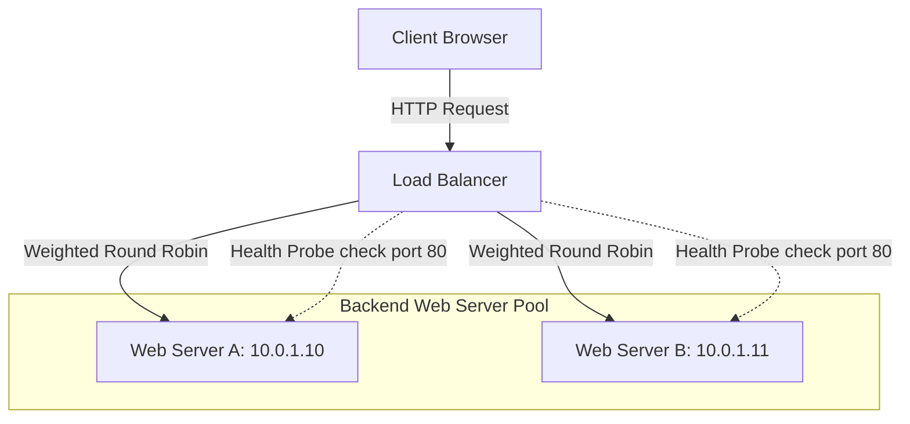

# Module 7: Servers & Infrastructure

Cloud infrastructure is built on top of physical data centers. This module covers virtualization mechanics, Type 1 vs. Type 2 hypervisors, block, file, and object storage systems, load balancing algorithms, and high availability architectures.

---

## 7.1 Virtualization & Hypervisors

Virtualization uses a software layer to abstract physical hardware, allowing a single physical computer (Host) to run multiple isolated operating systems (Guests) simultaneously.

```
       Type 1 Hypervisor (Bare-Metal)              Type 2 Hypervisor (Hosted)
  ┌──────────────────────────────────────┐  ┌──────────────────────────────────────┐
  │  VM 1 (Guest OS)   VM 2 (Guest OS)   │  │  VM 1 (Guest OS)   VM 2 (Guest OS)   │
  ├──────────────────────────────────────┤  ├──────────────────────────────────────┤
  │    Hypervisor (ESXi, KVM, Xen)       │  │    Hypervisor (VirtualBox, VMware)   │
  ├──────────────────────────────────────┤  ├──────────────────────────────────────┤
  │          Physical Hardware           │  │   Host Operating System (Windows)    │
  │     (CPU, RAM, Storage, Network)     │  ├──────────────────────────────────────┤
  │                                      │  │          Physical Hardware           │
  └──────────────────────────────────────┘  └──────────────────────────────────────┘
```

### 7.1.1 Type 1 (Bare-Metal) Hypervisors
Type 1 hypervisors install and execute directly on the raw physical host hardware. There is no host operating system underneath. The hypervisor acts as the minimal kernel-level operating system itself, directly managing CPU threads, memory allocations, and hardware buses.
*   **Characteristics:** Near-native execution speeds, extremely low virtualization latency/overhead, and strong security boundaries (no guest VM can access another's memory space).
*   **Real-world Examples:**
    *   **VMware ESXi:** The industry standard for enterprise data centers.
    *   **Linux KVM (Kernel-based Virtual Machine):** A module that converts the Linux operating system kernel itself into a Type 1 hypervisor, allowing guest VMs to run as native Linux processes scheduled directly by the Linux kernel.
    *   **Microsoft Hyper-V:** Directly controls the hardware layer, running the primary management OS (Windows) as a high-privileged virtual partition.
*   **Use Cases:** Enterprise data centers, high-performance database hosts, and public cloud infrastructure.

### 7.1.2 Type 2 (Hosted) Hypervisors
Type 2 hypervisors execute as an application layer inside a standard, pre-existing host operating system (such as Windows, macOS, or desktop Linux distros).
*   **Characteristics:** Higher resource overhead and latency. When a guest VM executes a system call to read from its virtual disk, the request must go from the VM to the Type 2 hypervisor, then through the Host OS kernel system calls, and finally to the physical storage device controller.
*   **Real-world Examples:**
    *   **Oracle VM VirtualBox:** A popular, open-source hosted hypervisor for local development.
    *   **VMware Workstation Pro / Player:** Runs on Windows and Linux desktops.
    *   **Parallels Desktop:** Optimized to run Windows guest VMs on macOS computers.
*   **Use Cases:** Local developer sandboxes, running legacy desktop software, and sandbox software testing.

### 7.1.3 Abstraction of Guest VMs
The hypervisor partitions physical hardware resources into virtual hardware resources:
*   **vCPU (Virtual CPU):** Time-sliced allocations of physical CPU threads. The hypervisor executes VM instructions on physical cores based on scheduling algorithms.
*   **Memory Overcommit:** Allocating more virtual RAM to guest VMs than exists physically on the host. The hypervisor dynamically swaps idle memory pages to disk to maximize utilization.
*   **Virtual Disk Images:** Large single files (like `.vmdk` or `.qcow2` files) stored on the host filesystem that the guest VM sees as raw block drives.

---

## 7.2 Storage Architecture Matrix

Enterprise server storage falls into three primary architectures:

| Feature | Block Storage | Network File Storage | Object Storage |
| :--- | :--- | :--- | :--- |
| **Structure** | Flat raw sectors (blocks). | Hierarchical folders and files. | Flat namespace of unique keys. |
| **Access Protocol** | SCSI, iSCSI, Fibre Channel. | NFS (UNIX), SMB (Windows). | HTTP REST APIs (GET, PUT, DELETE). |
| **Latency** | Ultra-low (microseconds). | Medium (milliseconds). | High (tens of milliseconds). |
| **Multi-Client Access** | No (Exclusive mount to one server). | Yes (Concurrent read/write by many). | Yes (Concurrent API access globally). |
| **Metadata** | None (formatting details only). | Basic (permissions, dates, size). | Unlimited customizable metadata tags. |
| **Scale Limit** | High (capacity of volume limits). | High (filesystem limit bounds). | Theoretically infinite scale. |

*   **Block Storage:** behaving like a raw, unformatted local hard drive. The operating system must partition and format the volume with a filesystem (like `ext4` or `NTFS`) before use.
*   **Network File Storage:** Shares files over a local network. Multiple servers can mount the same share, making it ideal for shared application state or assets.
*   **Object Storage:** Stores data as isolated "objects" containing the binary payload, unique identifiers, and metadata tags. Perfect for storing un-structured files (media, backups, logs).

### 7.2.1 Deep Dive: The Storage Pillar Mechanics

Storage infrastructure determines both data durability and application performance. A deep dive reveals how data is physically and logically managed:

*   **Physical Disk Interfaces:**
    *   **SATA (Serial ATA):** The legacy standard interface designed for HDDs. SATA III caps speed at 6 Gbps (~550 MB/s).
    *   **SAS (Serial Attached SCSI):** An enterprise-class interface. SAS supports faster spin speeds (up to 15K RPM for HDDs), higher reliability, and dual-port configurations for high-availability path redundancy.
    *   **NVMe (Non-Volatile Memory Express):** Designed specifically for solid-state storage. Instead of using legacy storage command queues, NVMe connects directly to the CPU over high-speed **PCIe lanes**, allowing massive parallelism (up to 64,000 queues with 64,000 commands per queue, compared to SATA's single queue of 32 commands).
*   **RAID Configurations (Redundant Array of Independent Disks):**
    To protect data against disk failure and increase speed, physical servers group multiple disks into a logical array using **RAID**:
    *   **RAID 0 (Striping):** Splits (stripes) data across two or more disks.
        *   *Pros/Cons:* Doubles read/write speeds, but provides **zero redundancy**. If one disk fails, the entire array's data is lost.
    *   **RAID 1 (Mirroring):** Duplicates identical data onto two or more disks.
        *   *Pros/Cons:* High fault tolerance (can lose half the drives) but expensive because storage capacity is cut by 50%.
    *   **RAID 5 (Striping with Distributed Parity):** Stripes data across three or more disks, writing mathematical "parity" data across all drives.
        *   *Pros/Cons:* Can tolerate a single disk failure without data loss. Rebuilding a failed disk is CPU-intensive.
    *   **RAID 10 (1+0 - Mirroring + Striping):** Combines mirroring and striping across four or more disks.
        *   *Pros/Cons:* Offers the high performance of RAID 0 and the high redundancy of RAID 1, but requires at least 4 disks and has 50% capacity overhead.
*   **Ephemeral vs. Persistent Storage:**
    *   **Ephemeral (Temporary) Storage:** Disk volumes physically attached to the server chassis hosting the virtual machine (like AWS Instance Store).
        *   *Characteristics:* Ultra-high IOPS and throughput, but data is volatile. If the virtual machine is stopped or migrated to another physical host, the data is permanently erased.
    *   **Persistent Storage:** Network-attached storage arrays (like SAN/NAS or AWS EBS) that exist independently of the compute instance life cycle.
        *   *Characteristics:* Slightly higher network transit latency, but data is durable. If the host hardware fails, the persistent volume can be unmounted and attached to another healthy server node without data loss.

---

## 7.3 High Availability (HA) & Load Balancing

High Availability ensures that if a hardware, network, or server component fails, the application continues to run without downtime.

### 7.3.1 HA Topologies
*   **Active-Active (Simultaneous Load):** Multiple active server nodes run concurrently behind a load balancer. The load balancer actively routes client requests across all servers in the pool. If any node crashes, the load balancer detects it and redistributes traffic to the remaining healthy nodes. This design simultaneously increases processing capacity and provides full redundancy.
*   **Active-Passive (Hot Standby):** Only one primary server handles all client traffic, while a secondary passive server sits idle as a backup.
    *   **Heartbeat Health Probes:** The passive backup server continuously monitors the active primary server by sending periodic ping requests ("heartbeats") over a private network connection.
    *   **Failover Mechanics:** If the active server crashes, it stops responding to heartbeats. Once a threshold is crossed (e.g. 3 consecutive failed pings), the passive server initiates a **Failover**:
        1.  It automatically assumes the network identity (IP address) of the primary server using Virtual Router Redundancy Protocol (VRRP).
        2.  It mounts the shared network storage volumes.
        3.  It starts the application service processes and begins accepting client requests.
    *   **Active vs. Passive Routing:** In active routing, the load balancer actively forwards requests to all nodes in the pool. In passive routing, the load balancer/DNS server directs 100% of the traffic to the single active node, only routing traffic to the passive node if the active node's health check status turns unhealthy.

### 7.3.2 Load Balancing Algorithms
Load balancers distribute incoming client requests across backend servers using specific scheduling algorithms:
*   **Round Robin:** Routes requests sequentially down the list of servers. Simple, but assumes all servers have equal capacity.
*   **Least Connections:** Routes the request to the server with the fewest active TCP connections. Ideal for long-lived queries or transactions.
*   **IP Hash:** Hashes the client's IP address to select a server. This guarantees that a specific client always routes to the same backend server (Session Stickiness).

---

## 7.4 Scalability Models

When application load increases, infrastructure must scale to meet demand:

```
            Vertical Scaling (Scale Up)             Horizontal Scaling (Scale Out)
                ┌────────────────┐                        ┌───┐   ┌───┐   ┌───┐
                │                │                        │   │   │   │   │   │
                │   CPU + RAM    │                        └───┘   └───┘   └───┘
                │    Enriched    │                      Server 1 Server 2 Server 3
                └────────────────┘
               Resize Single Server                     Add More Server Nodes
```

*   **Vertical Scaling (Scale Up):** Adding more CPU cores, RAM, or faster storage to a single server.
    *   *Limitations:* Hardware has physical caps (maximum slots on a motherboard). Also, changing resources usually requires a reboot, causing downtime.
*   **Horizontal Scaling (Scale Out):** Adding more identical server nodes to the pool.
    *   *Benefits:* Infinite scalability limits. Updates and scaling occur dynamically with zero downtime.

---

## 7.5 Advanced Datacenter Architecture, Virtualization, & Load Balancing

Cloud services are not ethereal; they execute on physical server components housed inside highly engineered datacenter facilities.

### 7.5.1 Physical Datacenter Architecture
Cloud datacenters guarantee 99.999% availability by protecting hardware against environmental and utilities failures:
*   **Redundant Power Infrastructure:** Datacenters receive power from two separate utility grid feeds. If grid power fails, massive **Uninterruptible Power Supplies (UPS)** (batteries/flywheels) maintain server power instantly. Simultaneously, automated transfer switches start up containerized **Diesel Generators** to provide continuous power for days.
*   **HVAC (Heating, Ventilation, & Air Conditioning) Systems:** Servers generate massive heat. Cooling systems maintain optimal temperatures (~18–27°C) and relative humidity. Modern datacenters use **Hot/Cold Aisle Containment** architectures and *evaporative free cooling* to maximize power usage efficiency (PUE).
*   **Physical Security access boundaries:** Tiered security controls require biometrics (fingerprint/iris scanners), physical access badges, security mantraps (one-way security doors), and continuous CCTV monitoring.

### 7.5.2 Hypervisor Deep-Dive & Hardware Emulation
Hypervisors manage how guest VMs translate their actions to host CPUs:
*   **Full Virtualization:** The hypervisor completely emulates the physical hardware. The guest OS is unaware it is running virtualized and requires no modification, but translating standard instructions to virtual devices requires binary translation, introducing small CPU overhead.
*   **Paravirtualization:** The guest OS is modified to be aware it is running in a virtualized environment. Instead of executing raw hardware commands, it sends direct software API calls (**Hypercalls**) to the hypervisor, lowering overhead.
*   **OS-Level Virtualization (Containers):** The host OS kernel shares its resources directly with isolated processes (containers). There is zero hypervisor layer or guest OS boot time, offering near-native execution performance.

### 7.5.3 Network Load Balancing Scheduling Algorithms
Load balancers distribute user traffic across a pool of backend servers using specific scheduling algorithms:
*   **Round Robin:** Routes requests sequentially down the list of servers. Ideal when servers are of equal hardware capacity.
*   **Weighted Round Robin:** Allows assigning a numeric weight to each server based on its capacity (e.g. Server A = weight 3, Server B = weight 1). Server A receives 3 requests for every 1 sent to Server B.
*   **Least Connections:** Directs traffic to the server with the fewest active TCP connections. Perfect for long-running transactional workloads.
*   **IP Hash:** Hashes the client's IP address to determine which server receives the request. This guarantees that a specific client always connects to the same backend server (session persistence / sticky sessions).

### 7.5.4 How It Works: Active-Active Load Balanced Architecture
The following Mermaid diagram shows an Active-Active high availability architecture where the load balancer routes client requests across redundant server nodes while continuously running health probes:



---

## 7.6 Hands-On Lab: Local Port Diagnostics & High Availability Simulation

### Overview
In this lab, you will use standard command-line diagnostics to test port availability and write a script to simulate a load balancer executing health checks against multiple local web ports, detecting node failures dynamically.

### Step 1: Run Port Diagnostics
Before testing connectivity, identify what ports are currently in use on your system:
*   **Linux/macOS:** Run `ss -tulpn` or `netstat -an`
*   **Windows (PowerShell):** Run `Get-NetTCPConnection -State Listen`

### Step 2: Create the Load Balancer Simulator
Create a new file named `lb_simulator.py` and paste the following code:

```python
import urllib.request
import time

# List of target server ports to simulate a load balancer pool
BACKEND_POOL = [
    {"name": "Server A", "url": "http://localhost:8080/"},
    {"name": "Server B", "url": "http://localhost:8081/"}, # This will fail unless you run another server
]

def execute_health_check(server):
    try:
        # Request the root page with a short timeout
        response = urllib.request.urlopen(server["url"], timeout=1.0)
        status = response.getcode()
        if status == 200:
            return "HEALTHY"
    except Exception:
        return "UNHEALTHY"

def load_balancer_monitor():
    print("Starting Load Balancer Monitor Simulation...")
    print("Ensure you have your web_server.py running on port 8080!")
    print("-" * 50)
    
    for i in range(3):
        print(f"\n[Cycle {i+1}] Running Health Probes...")
        for server in BACKEND_POOL:
            status = execute_health_check(server)
            if status == "HEALTHY":
                print(f" [+] {server['name']} ({server['url']}) is online -> Status: {status}")
            else:
                print(f" [!] ALERT: {server['name']} ({server['url']}) failed probe -> Status: {status}")
        time.sleep(2)

if __name__ == "__main__":
    load_balancer_monitor()
```

### Step 3: Run the Test
1.  Make sure your `web_server.py` from the previous module is running on port 8080.
2.  In a separate terminal, execute this simulation script:
    ```bash
    python lb_simulator.py
    ```
3.  Observe the output: Server A should report `HEALTHY`, and Server B (port 8081) should report `UNHEALTHY`. This simulates how cloud load balancers dynamically detect and bypass failed nodes.

---

## 7.7 Official Infrastructure References & Resources

To read official specifications and detailed manuals:
*   **Linux KVM Project:** [Kernel-based Virtual Machine Doc](https://www.linux-kvm.org/page/Main_Page) - Official specification manuals for native Linux virtualization.
*   **Xen Project:** [Xen Project Documentation](https://www.xenproject.org/help/documentation.html) - Architecture manuals detailing hypervisor hypercalls and paravirtualization rules.
*   **SNIA Storage Standards:** [Storage Networking Industry Association](https://www.snia.org/) - Official definitions and specifications for block, file, and object storage architectures.
