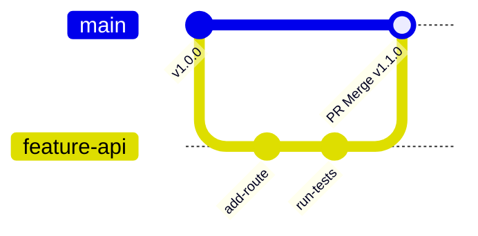

# Module 8: DevOps Foundations

DevOps bridges the gap between software development and systems operations. This module covers Git version control workflows, merge conflict resolution, CI/CD pipeline automation phases, containerization mechanics, and writing optimized Dockerfiles.

---

## 8.1 Git Version Control Guide

Git is a distributed version control system that tracks code history and coordinates work among developers.

### 8.1.1 The Four Git States
A file in a Git project moves between four main states:
1.  **Working Directory:** Local files on your disk that are not yet tracked or have modified unstaged changes.
2.  **Staging Area (Index):** A landing zone where you prepare changes to be packaged into a commit.
3.  **Local Repository:** A local database containing all committed snapshots and complete branch histories (`.git` directory).
4.  **Remote Repository:** A hosted copy of the database (e.g. on GitHub or GitLab) used to share changes with other developers.

```
       [ Working Directory ] ──(git add)──> [ Staging Area ] ──(git commit)──> [ Local Repo ]
                 │                                                                   │
                 └──────────────────────────────(git push)───────────────────────────▼
                                                                                [ Remote Repo ]
```

### 8.1.2 Git Command Cheat Sheet
*   **Initialize & Clone:**
    *   `git init` (Create a new local repository).
    *   `git clone <url>` (Download an existing remote repository).
*   **Track & Commit:**
    *   `git status` (Show modified, deleted, or unstaged files).
    *   `git add <file_path>` or `git add .` (Stage modified files).
    *   `git commit -m "commit message"` (Record staged files to local history).
    *   `git log --oneline` (Display compressed commit history).
    *   `git diff` (Show changes between working directory and staging).
*   **Branching & Merging:**
    *   `git branch <branch_name>` (Create a new branch).
    *   `git checkout <branch_name>` or `git switch <branch_name>` (Switch branches).
    *   `git checkout -b <branch_name>` (Create and switch to a new branch).
    *   `git merge <branch_name>` (Combine changes from targeted branch into current branch).
    *   `git rebase <branch_name>` (Re-apply commits from current branch on top of targeted branch).
*   **Stash & Temporary Storage:**
    *   `git stash` (Save modified files to temporary storage and revert to a clean state).
    *   `git stash pop` (Restore stashed files).
*   **Remote Operations:**
    *   `git push <remote> <branch>` (Upload local commits to remote repository).
    *   `git pull <remote> <branch>` (Download remote commits and merge them into your local branch).

### 8.1.3 Resolving Merge Conflicts
A merge conflict occurs when two developers modify the same line of a file in different ways on different branches. When you try to merge them, Git halts and inserts conflict markers:

```text
<<<<<<< HEAD
print("Welcome to the production environment")
=======
print("Welcome to the testing sandbox")
>>>>>>> feature-branch
```

*   `<<<<<<< HEAD` to `=======` contains the code on your current branch.
*   `=======` to `>>>>>>> feature-branch` contains the code on the incoming branch.
*   **Resolution Process:**
    1.  Open the file and manually delete the conflict markers.
    2.  Edit the code to keep the desired version.
    3.  Stage the resolved file: `git add <file>`.
    4.  Commit the merge: `git commit -m "Resolve merge conflict"`.

---

## 8.2 Continuous Integration & Continuous Delivery (CI/CD)

CI/CD automates the transition of code from Git repositories to production servers.

### 8.2.1 The CI/CD Pipeline Phases
1.  **Code Commit Trigger:** A developer pushes code changes to a Git branch, triggering the build engine.
2.  **Continuous Integration (CI):**
    *   *Build:* Pull dependencies (e.g. `npm install`, `pip install`) and compile binaries.
    *   *Unit Testing:* Run fast unit tests and linter audits to catch syntax or logical bugs.
    *   *Vulnerability Scan:* Scan dependencies for known security exploits.
3.  **Continuous Delivery (CD):**
    *   *Integration Testing:* Deploy the code to a staging environment and run integration tests.
    *   *Deployment:* Push the release assets to production servers.

### 8.2.2 Deployment Strategies
*   **All-at-Once:** Deploys updates to all servers simultaneously. Fast, but causes downtime and carries high risk.
*   **Rolling Update:** Deploys updates to a subset of servers at a time, keeping others active. Prevents downtime, but results in different versions running simultaneously.
*   **Blue-Green:** Deploys the new version (Green) to an isolated duplicate environment while the old version (Blue) continues serving live traffic. Traffic is swapped instantly via a router or DNS change. Easy rollback, but doubles infrastructure cost.
*   **Canary:** Routes a small percentage (e.g. 5%) of live traffic to the new version. If error rates remain normal, traffic is gradually shifted to 100%.

---

## 8.3 Containers & Docker Mechanics

Containers package application code and dependencies into a single, standardized execution unit.

### 8.3.1 Containers vs. Virtual Machines
*   **Virtual Machines:** Virtualize hardware. Each VM has its own guest operating system kernel, virtual memory, and drivers, making them heavy (gigabytes) and slow to boot.
*   **Containers:** Virtualize the host operating system kernel. They run as isolated processes sharing the host OS kernel, making them lightweight (megabytes) and fast to boot (seconds).
*   **Isolation Isolation:** Linux achieves container isolation using two kernel features:
    *   **Namespaces:** Restrict what a container can see (isolates process lists, network devices, and mount points).
    *   **Control Groups (cgroups):** Restrict what a container can use (limits CPU, RAM, and disk I/O allocation).

### 8.3.2 Production-Ready Dockerfile Design
A `Dockerfile` is a text configuration containing instructions to assemble a container image.

Here is an optimized, multi-stage, production-ready Dockerfile for a Node.js web application:

```dockerfile
# Stage 1: Build & Compile
FROM node:18-alpine AS builder
WORKDIR /app
COPY package*.json ./
RUN npm ci
COPY . .
RUN npm run build

# Stage 2: Production Execution
FROM node:18-alpine AS runner
WORKDIR /app
ENV NODE_ENV=production
COPY package*.json ./
RUN npm ci --only=production
COPY --from=builder /app/dist ./dist

EXPOSE 3000
USER node
CMD ["node", "dist/server.js"]
```

### 8.3.3 Core Dockerfile Directives
*   `FROM`: Sets the baseline parent image. Using minimal distributions like `alpine` keeps images small and secure.
*   `WORKDIR`: Sets the working directory inside the container.
*   `RUN`: Executes commands inside the container during the build phase (e.g. compiling code).
*   `COPY`: Copies files from your local host machine to the container filesystem.
*   `EXPOSE`: Documents the network port the container runs on.
*   `ENV`: Sets environment variables.
*   `CMD` vs. `ENTRYPOINT`:
    *   `ENTRYPOINT`: Configures the binary executable that runs when the container starts.
    *   `CMD`: Sets default arguments for the `ENTRYPOINT`. Users can override `CMD` parameters when running the container.
    *   *Exec Form (`["node", "server.js"]`)* is preferred over *Shell Form (`node server.js`)* because it runs the process directly as PID 1, allowing the container to catch termination signals (like SIGTERM) correctly.

---

## 8.4 Infrastructure as Code & Git Branching Workflows

Modern DevOps architectures automate both software integration pipelines and the provisioning of hardware resources using declarative configurations.

### 8.4.1 Infrastructure as Code (IaC)
IaC is the practice of managing and provisioning computer infrastructure (networks, virtual machines, load balancers, and connection layouts) using machine-readable definition files, rather than manual hardware configuration or interactive configuration tools.
*   **Declarative vs. Imperative IaC:**
    *   **Declarative (What to build):** You define the desired end-state of the infrastructure (e.g. "I want a VPC with three subnets and a load balancer"). The IaC engine (like **Terraform** or **AWS CloudFormation**) automatically calculates the differences from the current state and executes the necessary API steps to achieve that target.
    *   **Imperative (How to build):** You define the specific sequence of commands or execution steps (e.g., "Run this CLI command to create a VM, then run this script to install Nginx"). Tools like **Ansible** or shell scripting are typically imperative.
*   **State Management:** Declarative IaC tools maintain a **State File** (e.g. `terraform.tfstate`). This file acts as a single source of truth, mapping logical resources in your configuration files to physical resource IDs in the cloud.
*   **Idempotency:** A critical property of IaC. An operation is **idempotent** if running it multiple times yields the exact same result without causing side effects. (e.g., if you run an IaC template requesting 2 EC2 instances, running it again will detect those instances exist and do nothing, rather than creating 2 more).

### 8.4.2 Git Branching Workflows
Teams use branching workflows to safely collaborate on a single codebase:
*   **Git Flow:** A structured, multi-branch workflow. It uses a long-lived `main` branch (production-ready code), a `develop` branch (integration branch), and short-lived branches for `feature/`, `release/`, and `hotfix/`. Highly structured, but slow and complex for continuous deployment.
*   **GitHub Flow:** A lightweight, branch-based workflow. Developers create a branch from `main`, commit changes, open a **Pull Request (PR)**, discuss/review code, merge to `main`, and deploy immediately. Ideal for fast, continuous delivery teams.
*   **Trunk-Based Development:** Developers commit small, frequent changes directly to a single master branch (the "trunk"), bypassing long-lived branches. Developers use *Feature Flags* to hide half-finished features in production. Eliminates "merge hell" but requires high test coverage automation.

### 8.4.3 How It Works: GitHub Flow Validation Pipeline
The following Mermaid diagram shows the validation stages of a branch under the GitHub Flow model before it is merged into the production trunk:



---

## 8.5 Hands-On Lab: Resolving Git Merge Conflicts Locally

### Overview
In this lab, you will initialize a Git repository on your local computer, create two branches, modify the same line of the same file in different ways to generate a merge conflict, and manually resolve the conflict.

### Prerequisites
*   Git installed on your local computer.

### Step 1: Initialize the Local Repository
1.  Open your terminal and create a temporary directory inside your workspace:
    ```bash
    mkdir git-lab
    cd git-lab
    ```
2.  Initialize a new Git repository:
    ```bash
    git init -b main
    ```
3.  Create a file named `deployment.txt` and write the initial line:
    ```text
    Environment: Development
    ```
4.  Stage and commit this file to establish your base history:
    ```bash
    git add deployment.txt
    git commit -m "Initial commit on main"
    ```

### Step 2: Create Branch A (Production branch)
1.  Create and switch to a branch named `prod-config`:
    ```bash
    git checkout -b prod-config
    ```
2.  Edit `deployment.txt` to change the environment line to:
    ```text
    Environment: Production Gateway
    ```
3.  Commit the change:
    ```bash
    git add deployment.txt
    git commit -m "Update environment to Production"
    ```

### Step 3: Create Branch B (Staging branch from main)
1.  Switch back to the `main` branch:
    ```bash
    git checkout main
    ```
2.  Create and switch to a branch named `staging-config`:
    ```bash
    git checkout -b staging-config
    ```
3.  Edit `deployment.txt` (which still says `Development`) to change it to:
    ```text
    Environment: Staging Sandbox
    ```
4.  Commit the change:
    ```bash
    git add deployment.txt
    git commit -m "Update environment to Staging"
    ```

### Step 4: Generate the Merge Conflict
1.  Switch back to the `main` branch:
    ```bash
    git checkout main
    ```
2.  Merge the `prod-config` branch into `main` (this will succeed cleanly because `main` hasn't diverged yet):
    ```bash
    git merge prod-config
    ```
3.  Now, attempt to merge the `staging-config` branch (this will fail and trigger a conflict because both branches modified the same line):
    ```bash
    git merge staging-config
    ```
4.  Observe the terminal output indicating a **Merge Conflict** in `deployment.txt`.

### Step 5: Resolve the Conflict Manually
1.  Open `deployment.txt` in a text editor. You will see Git's conflict markers:
    ```text
    <<<<<<< HEAD
    Environment: Production Gateway
    =======
    Environment: Staging Sandbox
    >>>>>>> staging-config
    ```
2.  Resolve the conflict by choosing to merge both values or select one (e.g., let's edit the file to read):
    ```text
    Environment: Production Gateway and Staging Sandbox
    ```
    *(Ensure you delete the `<<<<<<<`, `=======`, and `>>>>>>>` lines completely).*
3.  Save the file.
4.  Stage the resolved file and commit to complete the merge:
    ```bash
    git add deployment.txt
    git commit -m "Resolve merge conflict between prod and staging configs"
    ```
5.  Verify that your Git history is clean:
    ```bash
    git log --oneline --graph
    ```

---

## 8.6 Official DevOps References & Manuals

To access official documentation guides and reference manuals:
*   **Git Reference Manual:** [Git-SCM Documentation](https://git-scm.com/doc) - The official Book, reference sheets, and command manuals.
*   **Docker Reference Manual:** [Docker Documentation](https://docs.docker.com/) - The primary portal for Dockerfile instructions, Docker CLI commands, and container engines.
