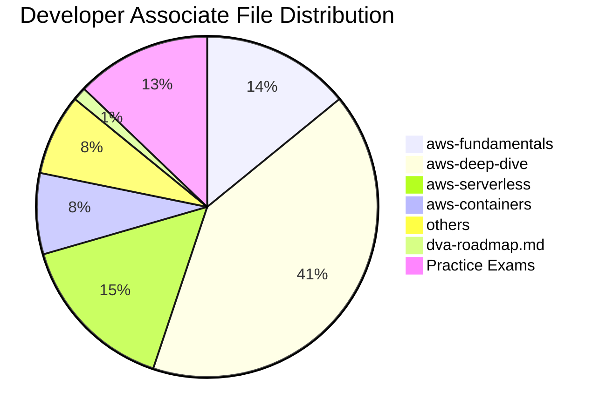
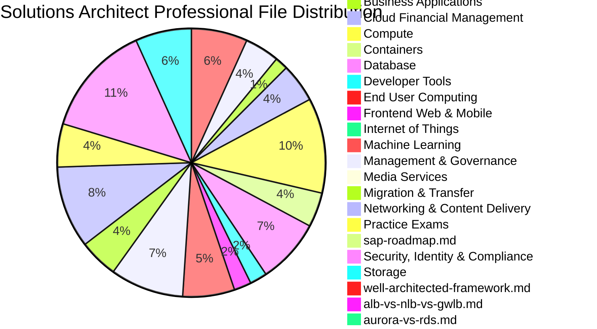

# AWS Documentation Coverage Report

## Developer Associate (Total Files: 78)

| Category | Files Count |
|---|---|
| aws-fundamentals | 11 |
| aws-deep-dive | 32 |
| aws-serverless | 12 |
| aws-containers | 6 |
| others | 6 |
| dva-roadmap.md | 1 |
| Practice Exams | 10 |

## Solutions Architect Professional (Total Files: 227)

| Category | Files Count |
|---|---|
| intro.md | 2 |
| how-computers-work.md | 1 |
| linux-fundamentals.md | 1 |
| networking-fundamentals.md | 1 |
| programming-fundamentals.md | 1 |
| databases.md | 1 |
| web-application-fundamentals.md | 1 |
| servers-infrastructure.md | 1 |
| devops-foundations.md | 1 |
| security-foundations.md | 1 |
| beginner-roadmap.md | 1 |
| Analytics | 13 |
| Application Integration | 8 |
| Blockchain | 1 |
| Business Applications | 3 |
| Cloud Financial Management | 9 |
| Compute | 22 |
| Containers | 8 |
| Database | 15 |
| Developer Tools | 4 |
| End User Computing | 2 |
| Frontend Web & Mobile | 4 |
| Internet of Things | 1 |
| Machine Learning | 12 |
| Management & Governance | 17 |
| Media Services | 1 |
| Migration & Transfer | 9 |
| Networking & Content Delivery | 19 |
| Practice Exams | 10 |
| sap-roadmap.md | 1 |
| Security, Identity & Compliance | 26 |
| Storage | 13 |
| well-architected-framework.md | 1 |
| alb-vs-nlb-vs-gwlb.md | 1 |
| aurora-vs-rds.md | 1 |
| cloudfront-vs-global-accelerator.md | 1 |
| dms-vs-mgn.md | 1 |
| ecs-vs-eks.md | 1 |
| efs-vs-fsx.md | 1 |
| sns-vs-eventbridge.md | 1 |
| sqs-vs-mq.md | 1 |
| transit-gateway-vs-cloud-wan.md | 1 |
| enterprise-landing-zone.md | 1 |
| global-saas-platform.md | 1 |
| hybrid-enterprise-network.md | 1 |
| iot-platform.md | 1 |
| media-streaming-platform.md | 1 |
| multi-region-dr.md | 1 |
| root | 1 |

